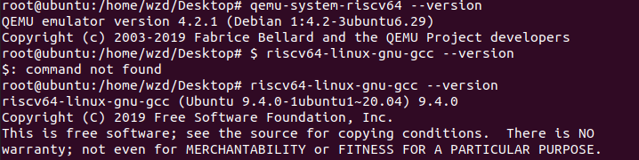

# 同济大学操作系统课程设计—— Xv6 Intro

 ###### 2151422武芷朵  Tongji University, 2024 Summer

[TOC]

# 1. 实验环境

VMware 16pro

ubuntu 20.04

xv6-labs-2021

# 2. 实验项目

xv6 实验为 2021 年版本的xv6 Labs，共分为以下 10 个实验：

- 1.Lab Utilities：实用工具实验

- 2.Lab System calls：系统调用实验

- 3.Lab Page tables：页表实验

- 4.Lab Traps：中断实验

- 5.Lab Copy on-write：写时复制实验

- 6.Lab Multithreading：多线程实验

- 7.Lab network driver：网卡驱动实验

- 8.Lab Lock：锁的实验

- 9.Lab File system：文件系统实验

- 10.Lab mmap：内存映射实验

Lab Utilities和Lab System calls主要涉及操作系统的使用与修改的基本方法；Lab Page tables、Lab Traps、Lab Multithreading和Lab File system 主要涉及操作系统中内存管理、进程管理和文件管理的重要概念；而 Lab Copy on-write、Lab network driver、Lab Lock和Lab mmap 主要是概念的综合应用，在真实的现代操作系统中也较为常见。

# 3. 实验环境配置

1.官网下载VMware 16pro和ubuntu 20.04；

2.VMware创建Ubuntu虚拟机；

3.打开终端，设置root密码:

```
sudo passwd

su
```

4.安装本项目所需的所有软件

```
sudo apt-get update && sudo apt-get upgrade

sudo apt-get install git build-essential gdb-multiarch qemu-system-misc gcc-riscv64-linux-gnu binutils-riscv64-linux-gnu
```

5.测试安装

```
qemu-system-riscv64 --version

riscv64-linux-gnu-gcc --version
```



# 4. 项目代码仓库链接
[wzd232604/TJOS-xv6-2024-labs (github.com)](https://github.com/wzd232604/TJOS-xv6-2024-labs)