# 同济大学操作系统课程设计——Lab1: Xv6 and Unix utilities

 ###### 2151422武芷朵  Tongji University, 2024 Summer

[TOC]

Lab1: Xv6 and Unix utilities 实用工具实验

项目地址：[wzd232604/TJOS-xv6-2024-labs: 同济大学操作系统课程设计-xv6实验 (github.com)](https://github.com/wzd232604/TJOS-xv6-2024-labs)

# 1.Boot xv6 (easy)

##　1.1 实验目的

启动xv6,熟悉xv6及部分重要的系统调用。

## 1.2 实验步骤

1.获取实验室的 xv6 源代码并检出 util 分支：

```
$ git clone git://g.csail.mit.edu/xv6-labs-2021

Cloning into 'xv6-labs-2021'...

...

$ cd xv6-labs-2021

$ git checkout util

Branch 'util' set up to track remote branch 'util' from 'origin'.

Switched to a new branch 'util'
```

2. 利用make qemu指令运行xv6：

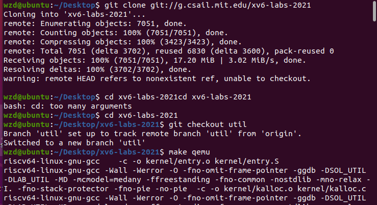

3. 输入ls指令能看到内容输出，这些是使用 ls 指令列出根目录下的文件。

   在 xv6 中按 Ctrl + p 会显示当前系统的进程信息。

   在 xv6 中按 Ctrl + a ，然后按 x 即可退出 xv6 系统。

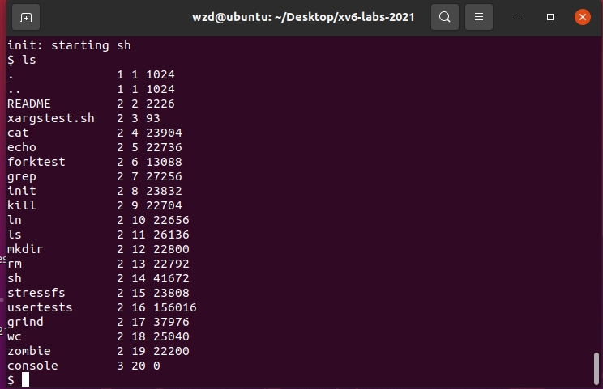 


## 1.3 实验中遇到的问题和解决办法

在安装环境时遇到较多困难，通过网上查阅资料，和同学讨论等方法正确安装虚拟机等。

## 1.4 实验心得

- 通过本实验，我初步了解了 xv6 这一操作系统内核，同时也了解了 qemu 模拟器的使用方法：可以直接使用 make qemu 编译并在 qemu 中运行 xv6 。若一切正常，make 将会执行一系列的编译和链接操作，输出大量的log ，并且用 qemu 启动 xv6 系统。

- xv6 启动后，init 进程会启动一个 shell 等待用户的命令。在这个简易的 shell 中，可以使用 ls 指令列出根目录下的文件。

- 若要结束运行 xv6 并终止 qemu，需在键盘上同时按下 Ctrl+A 键，然后按下 X 键，即可终止 qemu 的运行。

# 2.sleep (easy)

## 2.1 实验目的 

实现xv6的UNIX程序sleep：sleep应该使当前进程暂停用户指定的时钟周期数，其中tick计时数是xv6内核定义的时间概念，即定时器芯片两次中断之间的时间。解决方案应该在文件`user/sleep.c`中。

## 2.2 实验步骤

使用系统调用sleep：实现的源码放置在 `user/sleep.c`。

1. 参阅`kernel/sysproc.c`以获取实现sleep系统调用的xv6内核代码：

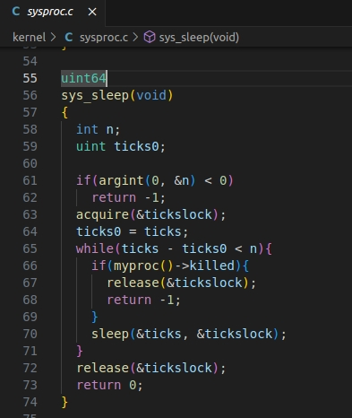 

`user/user.h`提供了sleep的声明以便其他程序调用：

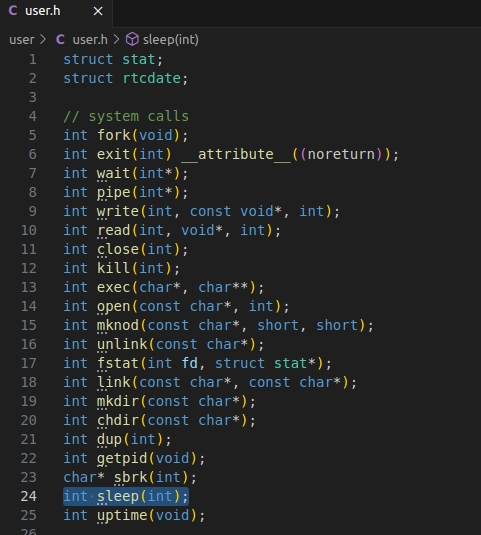 

用汇编程序编写的`user/usys.S`可以帮助sleep从用户区跳转到内核区；

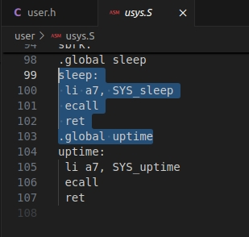 

2. 仿照`user/echo.c`的写法，写`user/sleep.c`文件，确保main函数调用exit()以退出程序；

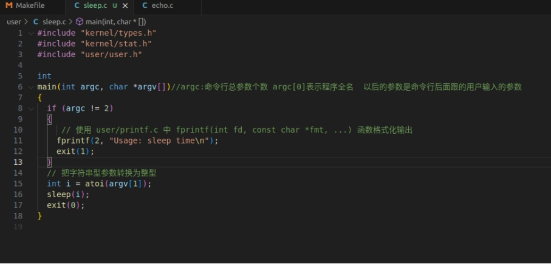 

3. 将sleep程序添加到`Makefile`中的UPROGS中即可运行；

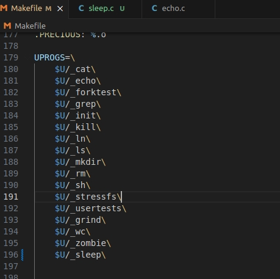 

4. 保存后在终端里执行make qemu编译运行xv6；

5. 在命令行中输入 sleep + 参数(例如10)，则系统会在10个时钟周期后重新出现命令行；

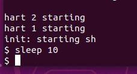 

如果命令行参数不等于2个，则打印错误信息：

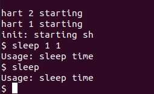 

6. 在终端里运行 `./grade-lab-util sleep` 可进行评分：

 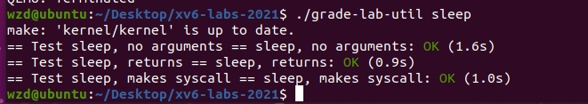

## 2.3 实验中遇到的问题和解决办法
 1. 问题：程序在输入了不正确的参数时崩溃。

- 解决办法：在main函数中，判断参数数量是否等于2，如果不是,则表示输入参数数量不正确，返回

`Usage: sleep time`。

 2. 问题：运行命令 `./grade-lab-util sleep`时报错为`exec./grade-lab-util failed`。

- 解决办法：需要同时按下 Ctrl+A 键，然后按下 X 键，终止 qemu 的运行,在终端执行命令。

## 2.4 实验心得

- 实验时需要明白程序的功能，并且阅读该程序相关的依赖文件，理清参数传递和头文件依赖关系等，避免参数传递出错或缺少头文件等。

- 在编译并运行 sleep 程序之前，我们除了需要正确配置 xv6 环境之外，还需要及时让系统支持并正确实现 sleep 系统调用，否则程序将无法被系统调用并运行测试。
- 使用循环和条件语句进行参数的检查和处理,避免参数出错。

# 3 pingpong (easy)

## 3.1 实验目的

编写一个使用UNIX系统调用的程序,  在两个进程之间“ping-pong”一个字节，使用两个管道，每个方向一个。父进程应该向子进程发送一个字节;子进程应该打印“<pid>: received ping”，其中<pid>是进程ID，并在管道中写入字节发送给父进程，然后退出;父级应该从读取从子进程而来的字节，打印“<pid>: received pong”，然后退出。解决方案应该在文件`user/pingpong.c`中。

## 3.2 实验步骤

使用系统调用：

- 使用pipe来创造管道;

- 使用fork创建子进程;

- 使用read从管道中读取数据，并且使用write向管道中写入数据;

- 使用getpid获取调用进程的pid。

实现的源码放置在 `user/pingpong.c `。

1. 编写 `pingpong.c` 的代码程序;

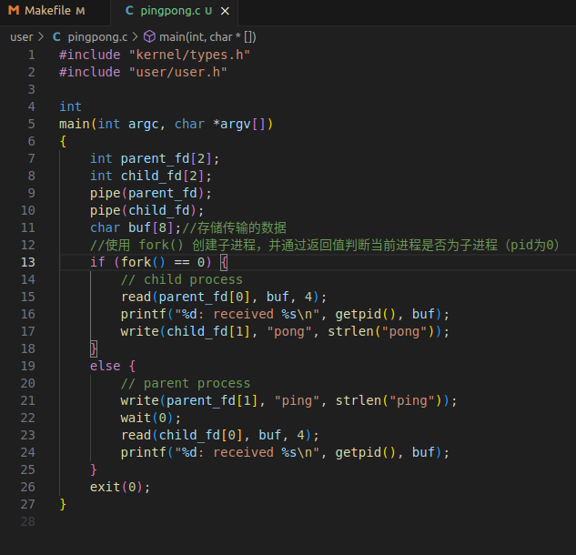

2. 将pingpong程序添加到`Makefile`中的UPROGS中即可运行；

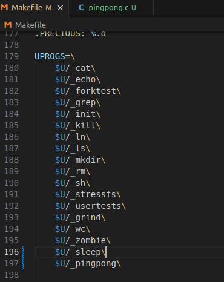

3. 保存后在终端里执行make qemu编译运行xv6；

4. 在命令行中输入`pingpong`，出现 :

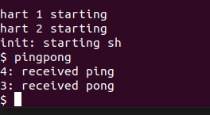

5. 在终端里运行 `./grade-lab-util pingpong`  可进行评分：


## 3.3 实验中遇到的问题和解决办法

  1. 问题：程序陷入死锁或出现死循环。

- 解决办法：检查是否有未正确关闭的文件描述符，在合适的时机关闭读写端，避免导致进程阻塞或死锁的情况。

2. 问题：如果在父进程中不使用 `wait()` 函数,会不会出现问题。

- 解决办法：本次的测试结果与不使用`wait()` 函数的结果相一致，但父进程可能会在子进程执行完成之前继续执行自己的代码。这可能会导致父进程在子进程还没有完成时就退出，从而使子进程成为没有父进程的进程。此外，没有正确等待子进程完成的父进程可能无法获取子进程的退出状态，也无法做进一步的处理。`wait()` 函数确保了父进程在子进程完成之后继续执行。

## 3.4 实验心得

- 通过这个实验，了解了管道的概念和使用方法，以及父子进程间的通信机制:使用pipe() 函数创建管道，使用fork()函数创建子进程，使用文件描述符来进行进程间的读写操作。
- 在父子进程间通信时，必须确保管道的正确打开和关闭，避免造成进程阻塞或死锁的情况。
- 进程通信要实现正确的进程同步。通过适当的管道读写操作和进程等待机制（如使用 `wait()` 函数）实现了父进程和子进程的同步，确保了数据的正确交换和打印顺序。
- 父子进程关系的理解：子进程是由父进程派生出来的，它们共享某些资源，并在不同的代码路径中执行。子进程的建立与`fork`系统调用有关,会将父进程的寄存器、内存空间和进程控制块复制一份，生成子进程，并且将子进程的进程控制块中的父进程指针指向其父进程；此时父子进程几乎完全一致，为了方便程序判断自己是父还是子，fork 会给两个进程不同的返回值，父进程得到的是子进程的 pid ，而子进程的返回值则为 0。

# 4  primes (moderate)/(hard)

## 4.1 实验目的

使用管道编写一个基本筛选器的并发版本,  将 2 至 35 中的素数筛选出来。想法来自于 Unix 管道的发明者 Doug McIlroy。学习使用`pipe`和`fork`来设置管道。第一个进程将数字2到35输入管道。对于每个素数创建一个进程，该进程通过一个管道从左边的邻居读取数据，并通过另一个管道向右边的邻居写入数据。由于xv6的文件描述符和进程数量有限，第一个进程可以在35处停止。

解决方案位于`user/primes.c` 中。

## 4.2 实验步骤

实现的源码放置在 `user/primes.c `。

创建父进程，父进程将数字2到35输入管道，在需要时创建管道中的进程。

对于2-35中的每个素数创建一个进程，进程之间需要进行数据传递：该进程通过一个管道从左边的父进程读取数据，并通过另一个管道向右边子进程写入数据。

对于每一个生成的进程而言，当前进程最顶部的数即为素数；对每个进程中剩下的数进行检查，如果是素数则保留并写入下一进程，如果不是素数则跳过。 

完成数据传递或更新时，需要及时关闭一个进程不需要的文件描述符（防止程序在父进程到达35之前耗尽xv6的资源）。当管道的写入端关闭时， read 函数返回 0 。

在数据传递的过程中，父进程需要等待子进程的结束，并回收共享的资源和数据等，即一旦第一个进程到达35，它应该等待直到整个管道终止。因此，主primes进程应该在所有输出都打印完毕，并且所有其他primes进程都退出后才退出。

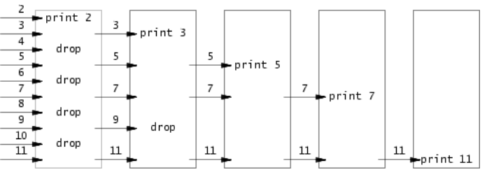

1. 编写 `primes.c` 的代码程序;

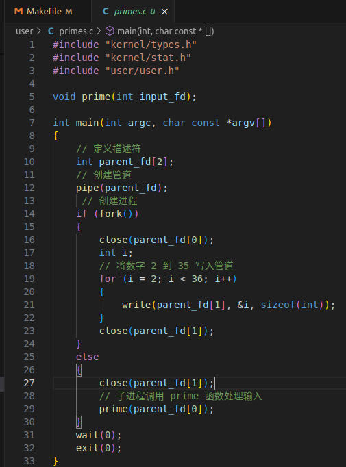

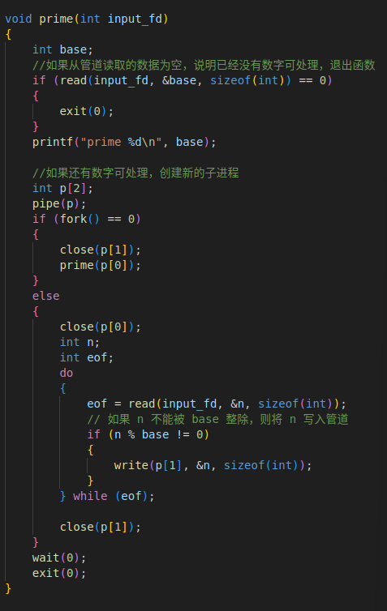

2. 将primes程序添加到`Makefile`中的UPROGS中即可运行；

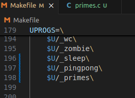

3. 保存后在终端里执行make qemu编译运行xv6；

4. 在命令行中输入`primes`，出现 :

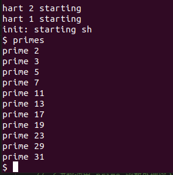

5. 在终端里运行 `./grade-lab-util primes`  可进行评分：

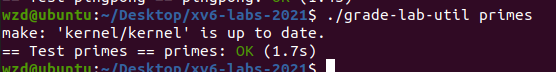

## 4.3 实验中遇到的问题和解决办法

  1. 问题：无法正确读取管道中的数据。

- 解决办法：检查管道的读取端和写入端是否正确关闭，以确保数据能够正确传递。

2. 问题：如果在父进程中不使用 `wait()` 函数,会不会出现问题。

- 解决办法：本次的测试结果与不使用`wait()` 函数的结果相一致，但父进程可能会在子进程执行完成之前继续执行自己的代码。这可能会导致父进程在子进程还没有完成时就退出，从而使子进程成为没有父进程的进程。此外，没有正确等待子进程完成的父进程可能无法获取子进程的退出状态，也无法做进一步的处理。`wait()` 函数确保了父进程在子进程完成之后继续执行。

## 4.4 实验心得

- 通过这个实验，实现了⼀个简单的质数筛选器。通过使用管道和递归调用，每个子进程将负责筛选出下⼀个质数，并将剩余的数字传递给下⼀个子进程。
- 实现过程中，需要维护读端和写端的管道，不断读取上一个进程写入管道的内容，并在 合适的条件下生成子进程并将其它数字写入管道。
- 加深了对fork系统调用的理解:子进程和父进程在 `fork()` 调用点之后的代码是独立执行的，并且拥有各自独立的地址空间。因此，父进程和子进程可以在 `fork()` 后继续执行不同的逻辑，实现并行或分支的程序控制流程。因此数据如果要实现传递，则可以在`fork()`判定为子进程的分支上进行数据“交换”，将子变为下一级的父，从而实现了数据传递。

# 5 find (moderate)

## 5.1 实验目的

学习并编写一个简单版本的UNIX查找程序：程序应当实现查找目录树中带有特定名称的所有文件。解决方案位于文件`user/find.c`中。

1. 理解文件系统中目录和文件的基本概念和组织结构。
2. 熟悉在 xv6 操作系统中使用系统调用和文件系统接口进行文件查找操作。
3. 应用递归算法实现在目录树中查找特定文件。

## 5.2 实验步骤

实现的源码放置在 `user/find.c`。

1. 查看`user/ls.c`以了解如何读取目录。 `user/ls.c`中包含一个`fmtname` 函数，用于格式化文件的名称。它通过查找路径中最后一个 `'/'` 后的第一个字符来获取文件的名称部分。如果名称的长度大于等于 `DIRSIZ`，则直接返回名称。否则，将名称拷贝到一个静态字符数组 `buf` 中，并用空格填充剩余的空间，保证输出的名称长度为 `DIRSIZ`。

   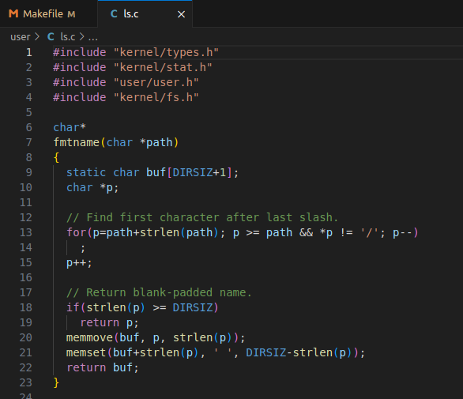

2. 编写 `find.c` 的代码程序;

```
void find(char *dir, char *file)
{   
    char buf[512], *p;
    int fd;
    struct dirent de;
    struct stat st;
    // open() 函数打开路径，返回一个文件描述符，如果错误返回 -1
    if ((fd = open(dir, 0)) < 0)
    {
        // 报错，提示无法打开此路径
        fprintf(2, "find: cannot open %s\n", dir);
        return;
    }
    // int fstat(int fd, struct stat *); 系统调用 fstat 与 stat 类似，但它以文件描述符作为参数
    // int stat(char *, struct stat *); stat 系统调用，可以获得一个已存在文件的模式，并将此模式赋值给它的副本; 以文件名作为参数，返回文件的 i 结点中的所有信息; 如果出错，则返回 -1
    if (fstat(fd, &st) < 0)
    {
        // 出错则报错
        fprintf(2, "find: cannot stat %s\n", dir);
        // 关闭文件描述符 fd
        close(fd);
        return;
    }
    if (st.type != T_DIR)// 如果不是目录类型
    {
        fprintf(2, "find: %s is not a directory\n", dir);
        // 关闭文件描述符 fd
        close(fd);
        return;
    }
    if(strlen(dir) + 1 + DIRSIZ + 1 > sizeof buf)// 如果路径过长放不入缓冲区，则报错提示
    {
        fprintf(2, "find: directory too long\n");
        // 关闭文件描述符 fd
        close(fd);
        return;
    }
    strcpy(buf, dir);// 将 dir 指向的字符串即绝对路径复制到 buf
    p = buf + strlen(buf);// buf 是一个绝对路径，p 是一个文件名，通过加 "/" 前缀拼接在 buf 的后面
    *p++ = '/';
    while (read(fd, &de, sizeof(de)) == sizeof(de))// 读取 fd ，如果 read 返回字节数与 de 长度相等则循环
    {
        if(de.inum == 0)
            continue;
        // strcmp(s, t);根据 s 指向的字符串小于（s<t）、等于（s==t）或大于（s>t） t 指向的字符串的不同情况分别返回负整数、0或正整数,不要递归 "." 和 "..."
        if (!strcmp(de.name, ".") || !strcmp(de.name, ".."))
            continue;
        // memmove，把 de.name 信息复制 p，其中 de.name 代表文件名
        memmove(p, de.name, DIRSIZ);
        if(stat(buf, &st) < 0)// 设置文件名结束符
        {
            fprintf(2, "find: cannot stat %s\n", buf);
            continue;
        }
        if (st.type == T_DIR)// 如果是目录类型，递归查找
        {
            find(buf, file);
        }
        else if (st.type == T_FILE && !strcmp(de.name, file))// 如果是文件类型 并且 名称与要查找的文件名相同
        {
            printf("%s\n", buf);
        } 
    }
}
```

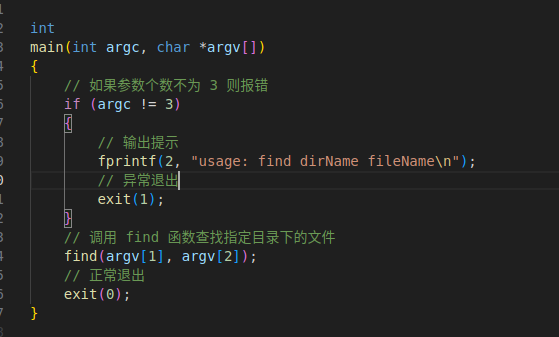

2. 将find程序添加到`Makefile`中的UPROGS中即可运行；

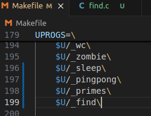

3. 保存后在终端里执行make qemu编译运行xv6；

4. 在命令行中输入以下命令 :

   mkdir为创建文件；

   echo为直接将数据写入文件，若文件存在则直接写入，若不存在的话新建并写入。

```
echo > b
mkdir a
echo > a/b
find . b

find a b
```

出现:

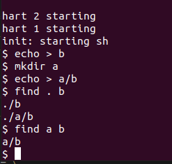

5. 在终端里运行 `./grade-lab-util find`  可进行评分：

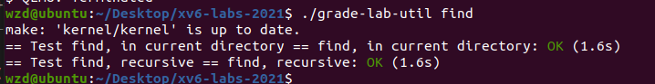

## 5.3 实验中遇到的问题和解决办法

  1. 问题：打开指定路径或获取文件信息失败，出现 "cannot open" 或 "cannot stat" 错误。

​       解决办法：检查路径,文件名是否正确，确认存在，并确保程序有足够的权限来打开该路径。

 2. 问题：路径过长，出现 "directory too long" 错误。

    解决办法：可能需要缩短路径或增加缓冲区的大小。

 3. 问题 : 无法继续向下递归地查找子目录中的文件。

    解决办法 : `ls.c`程序只能提供基本的文件和目录信息, 需要对 `find` 函数进行递归遍历。

## 5.4 实验心得

- 通过这个实验，深入理解了文件系统中目录和文件的关系，以及如何通过系统调用和文件系统接口来访问和操作文件。

- 通过这个实验，学会了使用递归算法实现对目录树的深度遍历，以便能够在整个目录结构中查找符合条件的文件。


# 6 xargs (moderate)

## 6.1 实验目的

编写一个UNIX xargs程序的简单版本：从标准输入中读取行，并为每一行运行一个命令，将行作为参数提供给命令。解决方案位于文件`user/xargs.c`中。

## 6.2 实验步骤

实现的源码放置在 `user/xargs.c`。

1. 通过示例理解xarg的工作原理：

   对字符串进行处理，| 之前的结果会在缓冲流中。

   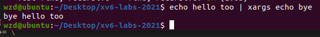

2. 编写 `xargs.c`的代码程序;

使用fork和exec对每行输入调用命令，在父进程中使用wait等待子进程完成命令。要读取单个输入行，一次读取一个字符，直到出现换行符（'\n'）

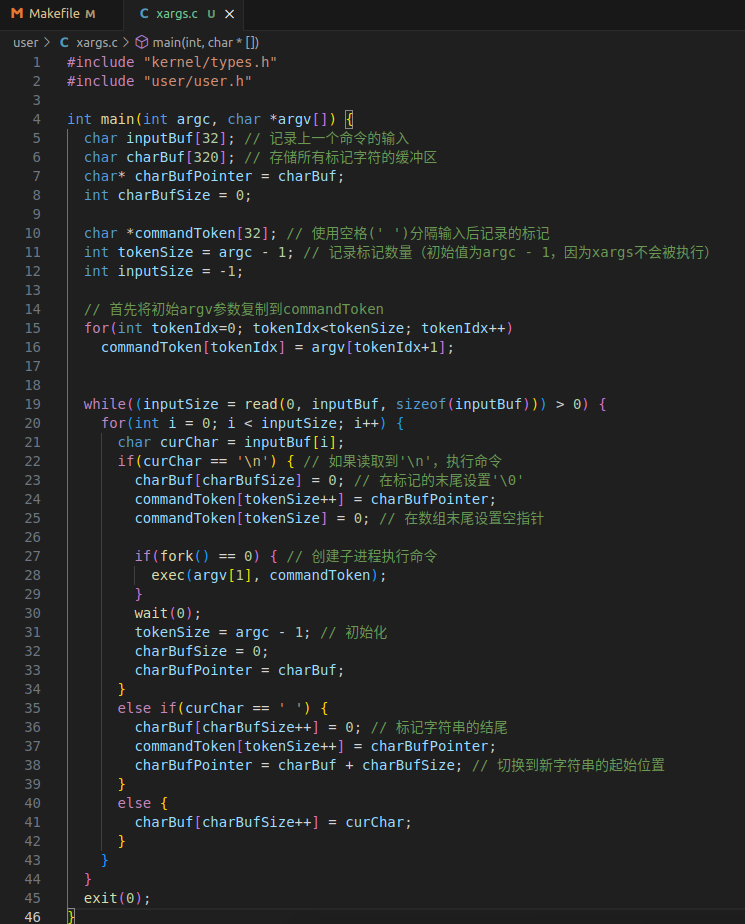

2. 将xargs程序添加到`Makefile`中的UPROGS中即可运行；

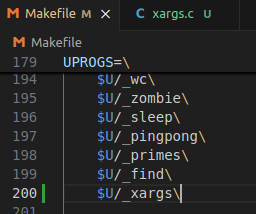

3. 保存后在终端里执行make qemu编译运行xv6；

4. 在命令行中输入以下命令 :`xargstest.sh`


5. 在终端里运行 `./grade-lab-util xargs`  可进行评分：

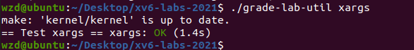

## 6.3 实验中遇到的问题和解决办法

  1. 问题：make qemu编译运行xv6输入`xargstest.sh`结果不符。

​       解决办法：运行中需要注意，对文件系统的修改会在运行 qemu 时持续存在；要获得一个干净的文件系统，运行 `make clean`，然后再运行 `make qemu`。

 2. 问题：输入缓冲区大小限制。

    解决办法：当前代码使用了⼀个固定大小的输入缓冲区 inputBuf[32] 。如果输入超过32个字符，可

    能会导致数据截断。可以考虑增加缓冲区大小或者动态分配内存。

 3. 问题 : 子进程执行命令时没有对执行结果进行处理。

    解决办法 : 当前代码在创建子进程后，调⽤了 exec 函数执行命令，但没有对命令执行结果进行处理。可以使用 wait 函数等待子进程执行完毕，并检查执行结果。

## 6.4 实验心得

- 通过这个实验，熟悉命令行参数的获取和处理，包括选项解析和参数拆分。
- 学习外部命令的执行,  调用exec函数来执行外部命令，理解执行外部程序的基本原理。
- 运行中需要注意，对文件系统的修改会在运行 qemu 时持续存在；要获得一个干净的文件系统，运行 `make clean`，然后再运行 `make qemu`。

# 7 实验检验得分

1. 在实验目录下创建`time.txt`, 填写完成实验时间数

2. 在终端中执行`make grade`

   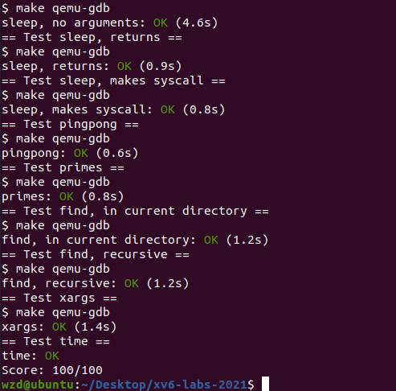

