# 同济大学操作系统课程设计——Lab10: mmap

 ###### 2151422武芷朵  Tongji University, 2024 Summer

[TOC]

Lab10: mmap：内存映射实验

项目地址：[wzd232604/TJOS-xv6-2024-labs: 同济大学操作系统课程设计-xv6实验 (github.com)](https://github.com/wzd232604/TJOS-xv6-2024-labs)

# 综述

- 熟悉系统调用的实现过程和原理。
- 掌握在操作系统中如何管理虚拟内存和内存映射。
- 实现 mmap 系统调用，将文件映射到指定的虚拟地址。
- 实现 munmap 系统调用，取消内存映射。

切换到 `mmap` 分支：

`git fetch`
`git checkout mmap`
`make clean`

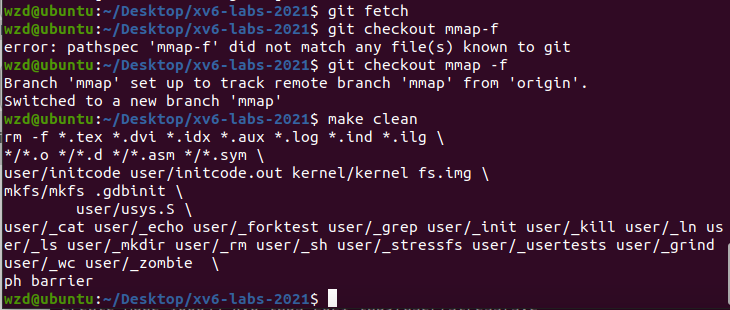

# 1.  mmap (hard)

##　1.1 实验目的

添加 `mmap` 与 `mumap` 两个系统调用，实现对进程地址空间的详细控制。前者将一个文件内存映射到进程的地址空间，后者取消已有地址空间的映射。

## 1.2 实验步骤

1. 在 `Makefile` 中添加 `$U/_mmaptest`

   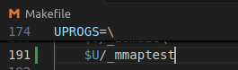

2. 添加有关 `mmap` 和 `munmap` 系统调用的定义声明：

   `kernel/syscall.h`：

   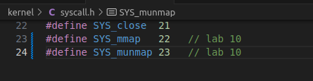

   `kernel/syscall.c`：

   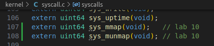

   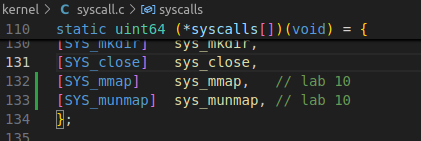

   `user/usys.pl`：

   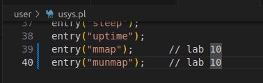

   `user/user.h`：

   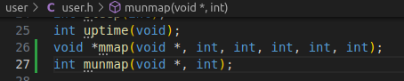

   `kernel/defs.h`:

   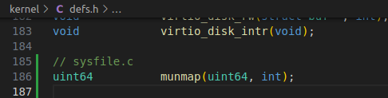

3. 在 `kernel/proc.h` 中定义 `struct vma` 结构体。同时在 `struct proc` 结构体中定义相关字段。

   根据实验指导的提示，对于每个进程都使用一个 VMA 的数组来记录映射的内存。此处定义了 MAXVMA 表示 VMA 数组的大小，并在 struct proc 结构体中定义了 vma 数组，又因为 VMA 是进程的私有字段，因此对于 xv6 的进程单用户线程的系统，访问 VMA 无需加锁。

   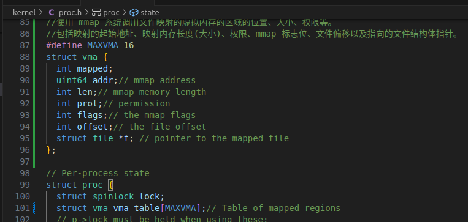

4. 在 `kernel/sysfile.c` 中实现系统调用 `sys_mmap()`，找到进程地址空间中未使用的区域，用于映射文件，并将 VMA 添加到进程的映射区域表中。VMA 应包含指向要映射文件的 `struct file` 的指针。确保在 `mmap` 中增加文件的引用计数，以防止文件在关闭时被删除：

   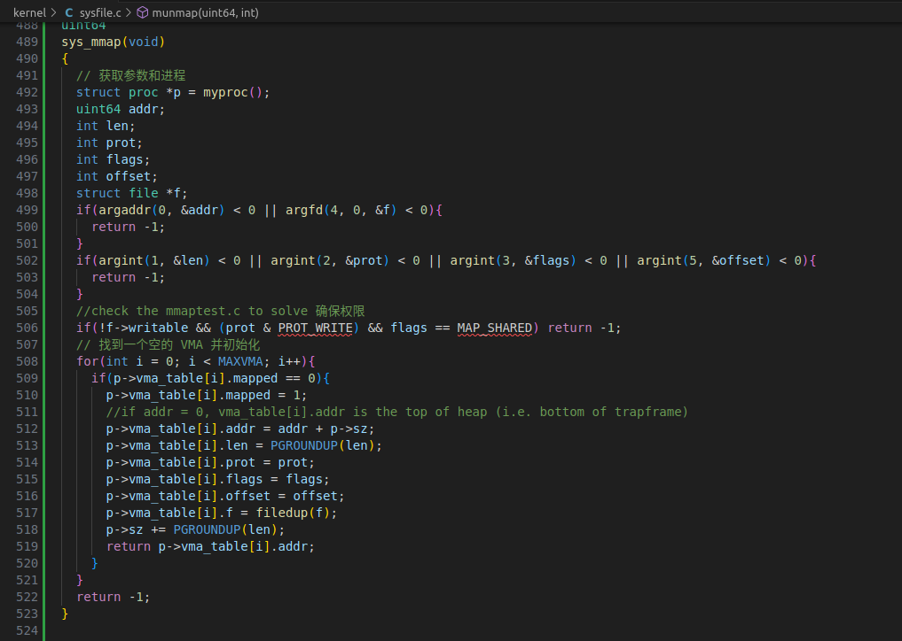

   1. 从用户传递的参数中提取信息，`len` 和 `offset` 参数使用 `int` 类型。
   2. 进行参数检查，`flags` 参数只能为 `MAP_SHARED` 或 `MAP_PRIVATE`，检查权限和偏移量的合法性。
   3. 从当前进程的 VMA 数组中分配一个 VMA 结构。
   4. 记录本次 `mmap` 的参数到分配的 VMA 结构中，在 `kernel/memlayout.h` 中定义 `MMAPMINADDR` 宏定义, 用于表示 `mmap` 可以用于映射的最低地址。为了确定映射地址，找到已映射内存的最高地址，向上对齐以确定新映射地址。若映射的地址空间会覆盖 `TRAPFRAME` 则会报错。
   5. 在 VMA 结构中记录映射的地址和长度，使用 Lazy allocation，实际内存页面在陷阱处理页面错误时分配。
   6. 记录其他参数到 VMA 结构中，对于文件指针，使用 `filedup()` 增加引用计数。
   7. 返回分配的地址，失败则返回 `-1`。

5. 修改 `kernel/trap.c` 中的 `usertrap()` 函数，处理页错误（Page Fault）情况。

   由于在 sys_mmap() 中对文件映射的内存采用的是 Lazy allocation，在访问未加载界面时，会产生一个缺页中断。因此需要对访问文件映射内存产生的 page fault 进行处理。当在 `mmap` 映射的区域发生页面错误时，分配一个物理内存页，从相关文件中读取 4096 字节到该页面，并将其映射到用户地址空间。

   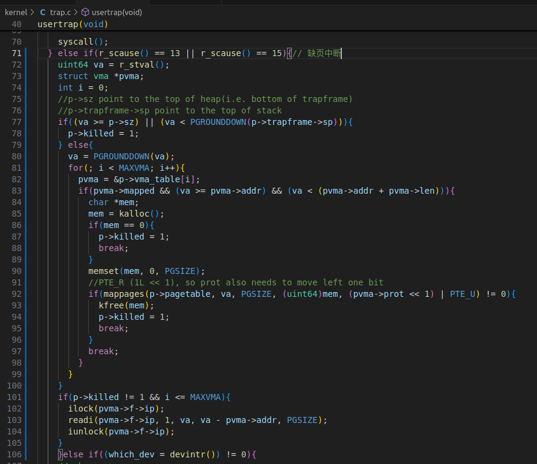

   1. 根据 `r_scause()` 值，检查是否发生页错误，可能的值为 13 和 15。
   2. 在当前进程的 VMA 数组中查找对应的 VMA 结构，比较虚拟地址 `va` 和 `pvma->addr + pvma->len`。
   3. 如果找到匹配的 VMA，继续处理，否则忽略该页错误。
   4. 对于存储错误（Store Page Fault），进行特殊处理，设置脏页标志位 `PTE_D`。
   5. 执行惰性分配，使用 `kalloc()` 分配物理页，并使用 `memset()` 清空物理页。
   6. 使用 `readi()` 从文件中读取数据到物理页，大小为 `PGSIZE`，对文件 inode 进行加锁。
   7. 根据 VMA 记录的权限参数将 PTE 权限标志位设置为对应的读、写、执行权限。
   8. 使用 `mappages()` 将物理页映射到用户进程的虚拟地址。

6. 在 `kernel/sysfile.c` 中实现系统调用 `munmap()`，找到要取消映射的地址范围的 VMA，并取消映射指定的页面。如果 `munmap` 移除了前一个 `mmap` 的所有页面，则应减少相应的 `struct file` 的引用计数。如果一个页面被修改且文件是 `MAP_SHARED` 映射，则将修改的页面写回文件：

   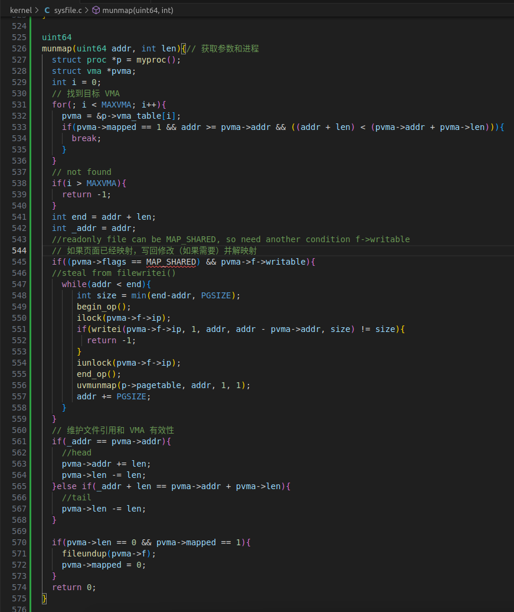

   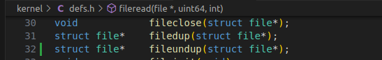

   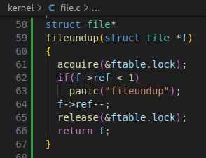

   1. 提取参数 `addr` 和 `length`。
   2. 检查参数，确保 `length` 非负，`addr` 是 `PGSIZE` 的整数倍。
   3. 根据 `addr` 和 `length` 找到对应的 VMA 结构体，未找到则返回失败。
   4. 若 `length` 为 0，直接返回成功。
   5. 判断 VMA 的标志位，若有 `MAP_SHARED`，则需要将修改的页面写回文件。
   6. 使用脏页标志位 `PTE_D` 判断哪些页面需要写回，设置为脏页后需要写入文件。
   7. 对于写回文件的大小，通常为 `PGSIZE`，但要考虑 `len` 可能不为 `PGSIZE` 整倍数。
   8. 使用类似于 `filewrite()` 的方法，分批次将修改写回文件，受日志块大小影响。
   9. 写回文件后，使用 `uvmunmap()` 取消用户页表中的映射，采用向上取整的取消映射方法。
   10. 更新 VMA 结构体，若取消的是整个文件映射内存区域，清空该 VMA。

7. 修改 `kernel/proc.c` 中的 `exit()` 函数和`fork()` 函数，复制、删除当前进程的 VMA 字段。

   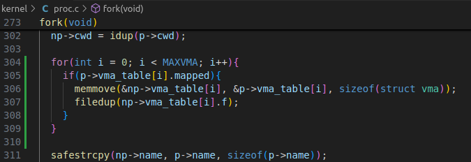

   在进程退出时，需要像 `munmap()` 一样对文件映射部分内存进行取消映射。因此添加的代码与 `munmap()` 中部分基本系统，区别在于需要遍历 VMA 数组对所有文件映射内存进行整个部分的映射取消。

   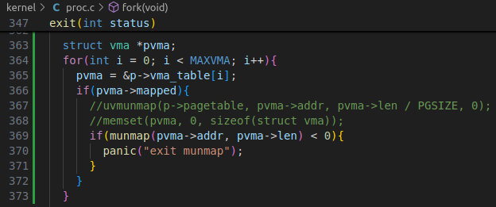

   修改 `fork`，以确保子进程与父进程具有相同的映射区域。不要忘记增加 VMA 的 `struct file` 的引用计数。在子进程的页面错误处理程序中，可以分配新的物理页面，而不是与父进程共享页面。

8. 更改`kernel/vm.c`修改`uvmcopy()`函数中

   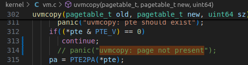

9. 利用make qemu指令运行xv6：

10. 在命令行中输入`mmaptest`:

   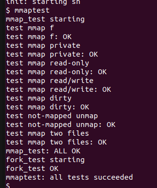

## 1.3 实验中遇到的问题和解决办法

  1. 问题：在测试过程中出现：

     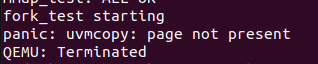

- 解决办法：更改`kernel/vm.c`修改`uvmcopy()`函数，`*pte & PTE_V) == 0`时继续执行而不报错。

2. 问题： 在映射地址的确定过程中，需要考虑如何正确处理延迟申请的情况。

- 解决办法：选择从 trapframe 的底部向下生长，同时修改对 uvmunmap 的实现，使得只取消已经映射的页，以解决这个问题。

## 1.4 实验心得

- 通过本次实验，我深入了解了操作系统中内存映射的原理与实现。学习如何处理系统调用，如何管理虚拟内存，以及如何在内核中维护进程的内存映射信息。
- 在整个实验过程中，我加深了对操作系统内存管理的理解，掌握了操作系统内核中的数据结构和函数调用，提升了我的编程和调试能力。通过不断的实践和探索，我对操作系统的各个组成部分有了更深入的认识，为我今后在系统编程和操作系统领域的学习和研究打下了坚实的基础。
- 实验中涉及到的 Lazy Allocation（延迟分配）机制是通过页表来实现的。在进行文件映射时，并不会立即分配物理内存，而是在页面首次访问时才触发物理内存的分配和内容填充。此间，页表记录了虚拟地址与物理地址之间的映射关系，Lazy Allocation 的实现需要在虚拟地址首次访问时，操作系统根据页表的映射关系将物理内存进行分配。
- mmap 系统调用的核心是将文件内容映射到虚拟内存中。这涉及到文件系统和虚拟内存的结合。操作系统需要维护文件的相关信息，如打开的文件描述符，然后通过文件描述符来获取文件内容，并将其映射到虚拟内存的合适位置。这种结合使得用户程序可以直接访问文件内容，而无需显式的读写操作。

# 2. 实验检验得分

1. 在实验目录下创建`time.txt`, 填写完成实验时间数

3. 在终端中执行`make grade`

   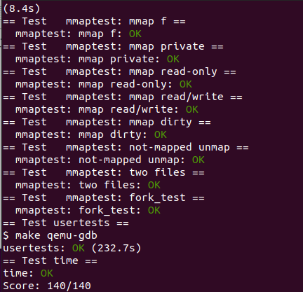
