# 同济大学操作系统课程设计——Lab2: System calls

 ###### 2151422武芷朵  Tongji University, 2024 Summer

[TOC]

Lab2: System calls：系统调用实验

项目地址：[wzd232604/TJOS-xv6-2024-labs: 同济大学操作系统课程设计-xv6实验 (github.com)](https://github.com/wzd232604/TJOS-xv6-2024-labs)

# 综述

Lab2中向 XV6 添加一些新的系统调用，并展示一些 xv6 内核的内部结构。

- 系统调用的用户空间代码在 `user/user.h` 和 `user/usys.pl` 中。

- 内核空间代码在 `kernel/syscall.h` 和 `kernel/syscall.c` 中。

- 与进程相关的代码在 `kernel/proc.h` 和 `kernel/proc.c` 中。

切换到 `syscall` 分支：

`git fetch`
`git checkout syscall`
`make clean`

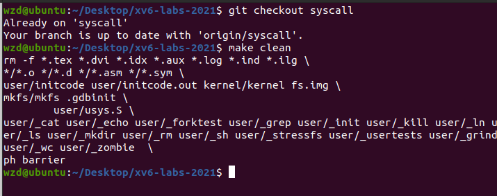

# 1. System call tracing (moderate)

##　1.1 实验目的

追踪系统调用：了解系统调用跟踪功能的实现。创建一个新的跟踪系统调用（`trace system call`），用于控制跟踪操作，追踪用户程序使用系统调用的情况。

该系统调用应接受一个整数参数 "`mask`"，其中的位数表示要跟踪的系统调用。例如，要跟踪 fork 系统调用，程序应调用 `trace(1 << SYS_fork)`，其中 `SYS_fork` 是来自 `kernel/syscall.h` 的系统调用号。该进程调用过 `trace(1 << SYS_fork)` 后，如果该进程后续调用了fork 系统调用，调用 fork 时内核则会打印形如`<pid>: syscall fork ->  <ret_value>` 的信息。

需要修改 `xv6` 内核以便在每个系统调用即将返回时打印一行输出，输出行应包含进程ID、系统调用名称和返回值，不需要打印系统调用的参数。`trace` 系统调用应启用调用它的进程以及其后续 `fork` 出的所有子进程的跟踪，但不应影响其他进程。

## 1.2 实验步骤

1. 在 Makefile 的 `UPROGS` 环境变量中添加 `$U/_trace`

   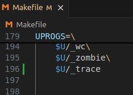

2. 添加系统调用的声明和存根：

   在 `user/user.h`中添加 trace 系统调用原型：(作为trace 系统调用在用户态的入口)

   `int trace(int);	// lab 2.1`

   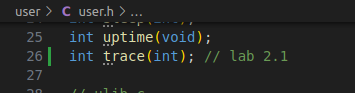

   在 `user/usys.pl` 脚本中添加 trace 对应的 entry:(生成调用 trace(int) 入口时在用户态执行的汇编代码)

   `entry("trace"); # lab 2.1`

   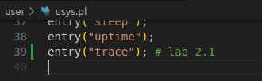

   在 `kernel/syscall.h` 中添加 trace 的系统调用号(为trace 分配一个系统调用的编号)

   `#define SYS_trace 22	// lab 2.1`

   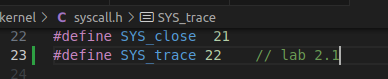

3. 编写 trace 的系统调用函数

   结构体 `struct proc` 的定义在 `kernel/proc.h` 中，该结构体记录着进程的转态。需要为 trace 系统调用添加一个变量 `tracemask` 来记录其参数。因为 trace 只会在本进程发挥作用，所以 tracemask 应该作为进程的私有变量。

   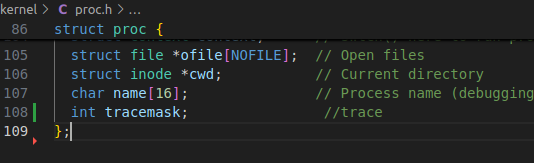

   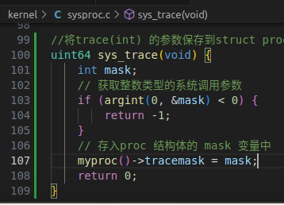

4. 修改 fork() 函数，将父进程的跟踪掩码复制到子进程。

   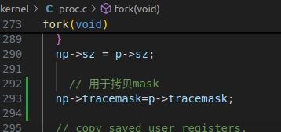

5. 在 `syscall.c` 中添加函数引用

   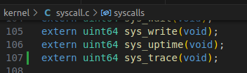

   在 `syscall.c` 中添加一个`syscall_names`数组，使用系统调用名称来索引。

   修改`syscall.c`中的`syscall()`函数以打印跟踪输出。

   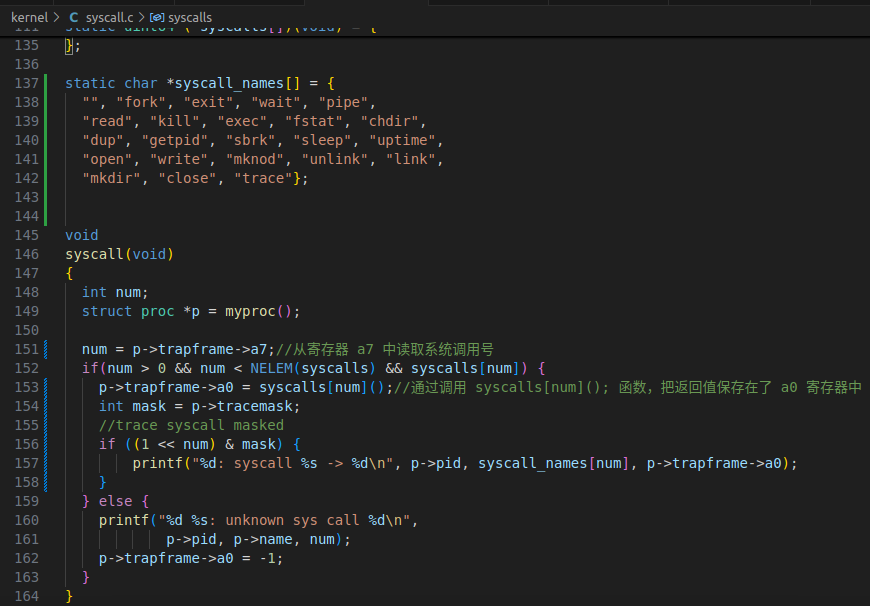

6. 保存后在终端里执行make qemu编译运行xv6；

7. 在命令行中输入`trace 32 grep hello README`，该语句就是一个进程，包含了多个系统函数，但我们只跟踪`read()`:（其中`32`是`1 << SYS_read` 即 `1 << 5`）

   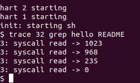

8. 在命令行中输入`trace 2147483647 grep hello README`，该语句就是一个进程，该进程包含了多个系统函数，同时，全部调用到的系统函数我们都跟踪：

   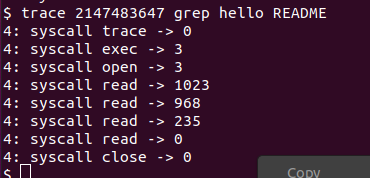

9. 在命令行中输入`grep hello README`，程序没有被跟踪，因此没有打印跟踪输出“：

   

10. 在命令行中输入`trace 2 usertests forkforkfork`，跟踪了 usertests 中 `forkforkfork` 测试的所有后代的 fork 系统调用：

    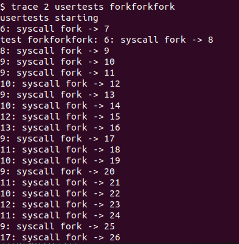

    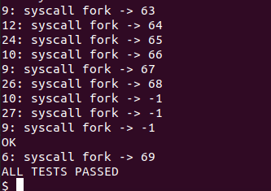

11. 在终端里运行 `./grade-lab-syscall trace` 可进行评分：

    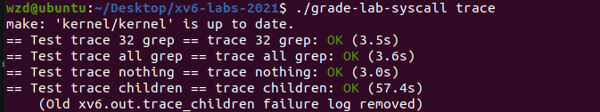

## 1.3 实验中遇到的问题和解决办法

  1. 问题：系统调用跟踪的输出与预期不符。

- 解决办法：检查代码中的跟踪输出部分，确保正确获取并打印所需的信息。确保在每个系统调用返回之前进行跟踪输出，检查系统调用的返回值。

2. 问题：用户态和内核态之间的数据传递失败。

- 解决办法：用户态和内核态之间的数据传递和状态切换的方面：

  1. 系统调用参数传递： 在实验中，用户程序通过调用 sys_trace 系统调用来传递一个整数参数 mask 给内核，用于指定要追踪的系统调用。用户程序通过 argint 函数将参数从用户空间传递到内核空间。

  2. 内核态与用户态切换： 当用户程序调用 sys_trace 系统调用时，会触发用户态切换到内核态。这个切换由系统调用机制完成。

  3. 数据传递和复制： 用户程序传递给内核的 tracemask 参数需要在内核中进行数据复制。当用户程序传递参数给内核时，内核需要正确地从用户空间复制数据到内核空间，以确保内核能够访问到正确的数据。

  4. 数据验证和权限检查： 在实验中，内核需要验证用户传递的 tracemask 参数是否合法，并确保用户程序有权限调用 sys_trace 系统调用。内核可以通过对 tracemask 进行合法性检查来防止恶意传递错误的参数。

3. 问题：`Timeout! trace children`超时。

- 解决办法：通过查阅资料发现可能是电脑性能不够强导致出现：

  ```
  == Test trace children == 
  $ make qemu-gdb
  Timeout! trace children: FAIL (30.2s) 
      ...
           9: syscall fork -> 56
           6: syscall fork -> -1
           7: syscall fork -> -1
           8: syscall fork -> -1
           qemu-system-riscv64: terminating on signal 15 from pid 5581 (make)
      MISSING '^ALL TESTS PASSED'
      QEMU output saved to xv6.out.trace_children
  ```

  最后选择在.py文件`gradelib.py`中改变超时判断时间70s。

  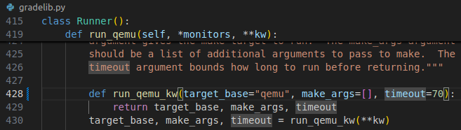


## 1.4 实验心得

- 通过本实验，我了解了如何在xv6内核中添加新的系统调用，如何修改进程控制块以支持跟踪掩码，并且理解了如何在内核中实现系统调用的功能。此外，我还了解了如何在用户级程序中调用新增的系统调用，并在实验中验证系统调用的正确性。

- 通过完成实验，我更深入地理解了操作系统的系统调用机制。我了解了用户空间和内核空间之间的交互方式，并学会了如何在用户程序中调用新添加的系统调用。此外，我还加深了对 xv6 内核的理解，包括系统调用的执行流程、内核数据结构和进程管理。

# 2.Sysinfo (moderate)

## 2.1 实验目的 

本实验添加一个系统调用`sysinfo`，用于收集有关正在运行的系统的信息。该系统调用接受一个参数：指向`struct sysinfo`结构体的指针（见`kernel/sysinfo.h`）。内核应填充该结构体的字段：`freemem`字段应设置为空闲内存的字节数，`nproc`字段应设置为状态不是`UNUSED`的进程数量。

提供了一个名为`sysinfotest`的测试程序；如果该程序打印出`"sysinfotest: OK"`，则表示通过此任务。

## 2.2 实验步骤

1. 在 Makefile 的 `UPROGS` 中添加 `$U/_sysinfotest`

   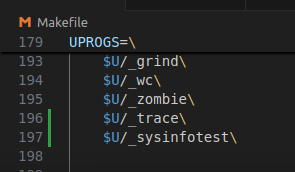

2. 添加系统调用的声明和存根：

   在 `user/user.h`中添加 `sysinfo()`调用原型：

   ```
   struct sysinfo；
   int sysinfo(struct sysinfo *)；
   ```

   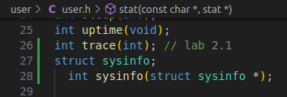

   在 `user/usys.pl` 脚本中添加 对应的 entry:

   `entry("sysinfo");# lab 2.2`

   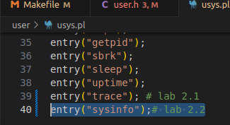

   在 `kernel/syscall.h` 中添加 trace 的系统调用号(为trace 分配一个系统调用的编号)

   `#define SYS_sysinfo  23// lab 2.2`

   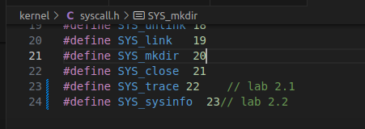

   在 `syscall.c` 中添加函数引用

   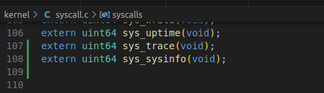

3. 编写函数,  获得空闲内存大小:

   在 `kernel/kalloc.c` 实现一个函数。由于 xv6 管理内存空闲空间使用的是空闲链表，参照链表的结构后，只需遍历链表并计算数量，然后乘以页面大小即可。

   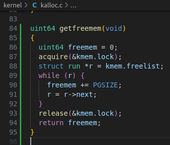

4. 编写函数,  统计空闲进程控制块的数量：

   在 `kernel/proc.c` 实现一个函数。进程控制块是用静态数组管理的， 故而只需要用一个循环遍历该数组即可。

   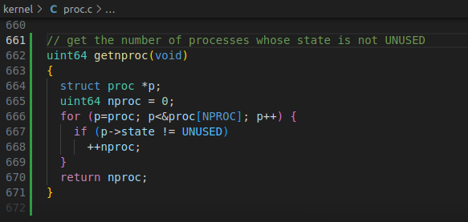

5. 在 `kernel/sysproc.c` 中实现的 `sys_ sysinfo(void)`

   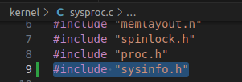

   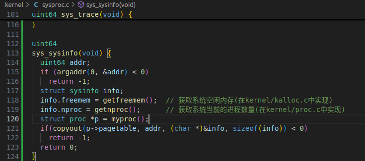

6. 在 `kernel/defs.h` 中添加函数原型

   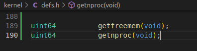

7. 保存后在终端里执行make qemu编译运行xv6；

8. 在命令行中输入`sysinfotest`:

   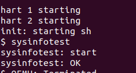

9. 在终端里运行 `./grade-lab-syscall sysinfo` 可进行评分：

   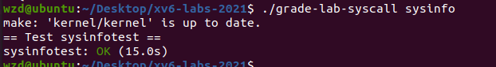

## 2.3 实验中遇到的问题和解决办法
 1. 问题：如何根据现有的源码提取出可供我们利用的参数。

- 解决办法：参考`kalloc()` 和 `kfree()` 等函数，发现内核通过 `kmem.freelist` 的一个链表维护未使用的内存，同时链表的每个结点还对应了页表大小(PGSIZE)，所以需要乘上页表大小才获得了可用内存数。

 2. 问题：`sysinfotest` 程序无法编译或输出不正确。

- 解决办法：检查代码中的编译错误并修复。确保正确实现 `sysinfo` 系统调用，并在该系统调用中正确填充 `struct sysinfo` 的字段。使用 `copyout()` 函数将数据正确地复制到用户空间。

## 2.4 实验心得

- 通过本次实验，我学会为系统添加了一个新的系统调用 `sysinfo`，实现了收集运行系统的信息，如可用内存数、进程数等。

- 在完成实验的过程中，我还了解了实现所需的几个基础数据结构，比如kmem链表，以及表示进程状态的字段`UNUSED`等。要实现这些能够反应系统运行信息功能，首先需要了解这些信息分别由什么记录，这样才能更有针对性地做出追踪和检测。

- xv6将空闲物理内存划分成一系列 4096 字节大小的 物理页. (每个物理页都是 4096 字节对齐的。将物理页组织成链表, 做法是在每个物理页的前 8 个字节记录下一页的起始地址。为实现这种管理方式, xv6 维护了一个数据结构 `kmem`。

  kmem.freelist 是链表中第一个结点的起始地址 (链表为空时, kmem.freelist == 0)；

  kmem.lock 是一个互斥锁, 保护共享数据 kmem.freelist。

# 3 实验检验得分

1. 在实验目录下创建`time.txt`, 填写完成实验时间数

2. 在终端中执行`make grade`

   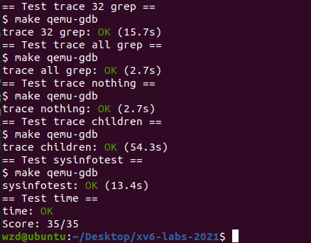

