# 同济大学操作系统课程设计——Lab3: Page tables

 ###### 2151422武芷朵  Tongji University, 2024 Summer

[TOC]

Lab3: Page tables：页表实验

项目地址：[wzd232604/TJOS-xv6-2024-labs: 同济大学操作系统课程设计-xv6实验 (github.com)](https://github.com/wzd232604/TJOS-xv6-2024-labs)

# 综述

Lab3探索页面表并对其进行修改，以加快某些系统调用并检测哪些页面已被访问。

- kern/mlayout.h，用于捕捉内存布局。
- kern/vm.c，包含大部分虚拟内存（VM）代码。
- kernel/kalloc.c，包含分配和释放物理内存的代码。

切换到 `pgtbl` 分支：

`git fetch`
`git checkout pgtbl`
`make clean`

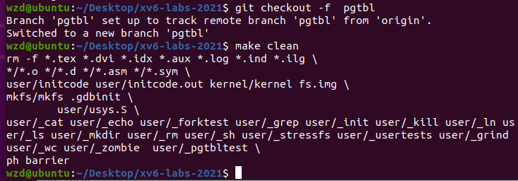

# 1. Speed up system calls (easy)

##　1.1 实验目的

使用页表机制加速系统调用：一些操作系统（如 Linux）通过在用户空间和内核之间共享只读区域中的数据来加快某些系统调用的速度。操作系统不会将内核的数据结构复制到用户空间，而是直接将存放该数据结构的页通过页表 的机制映射到用户空间的对应位置，从而免去了复制的开销，提高了系统的性能。本实验旨在学习如何在页表中插入映射，首先需要在 xv6 中的 `getpid()` 系统调用中实现这一优化。

通过在用户空间和内核之间共享一个只读区域中的数据，来加速特定的系统调用。具体而言，通过在进程创建时映射一个只读页，将一个 `struct usyscall` 结构放置在该页的开头，该结构会存储当前进程的 `PID`。这将使得在执行某些系统调用时，不需要进行用户空间和内核之间的频繁切换，从而提高系统调用的性能。

## 1.2 实验步骤

1.在 `kernel/proc.h` 的proc 结构体中添加指针来保存这个共享页面的地址：

`struct usyscall *usyscallpage;`


2. 在`kernel/memlayout.h`中完成映射页面工作

   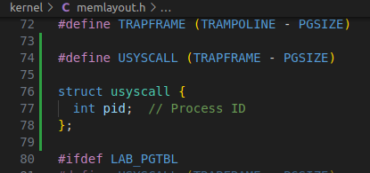

3. 在 `kernel/proc.c` 的 `allocproc()` 函数中完成共享页的分配和初始化：

   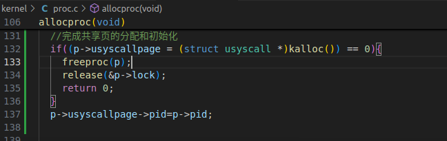

4. 在 `kernel/proc.c` 的 `proc_ pagetable(struct proc *p)` 完成为新创建的进程分配页面的函数。页面映射时，需要设定其权限为只读，故权限位为 PTE_R  |  PTE_U ：

   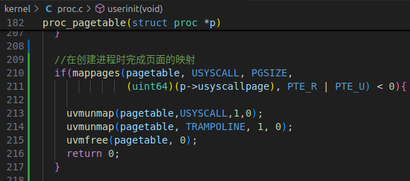

5. 在 `kernel/proc.c` 的 `freeproc()` 完成在进程结束后释放分配的页面的函数：

   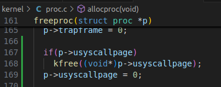

6. 在 `kernel/proc.c` 的 `proc_freepagetable(pagetable_t pagetable, uint64 sz)` 完成释放页表中对应的页表项的函数：

   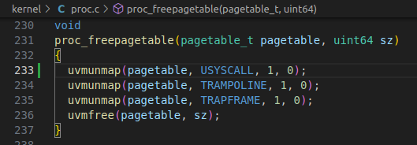

7. 利用make qemu指令运行xv6：

8. 在命令行中输入`pgtbltest`:

   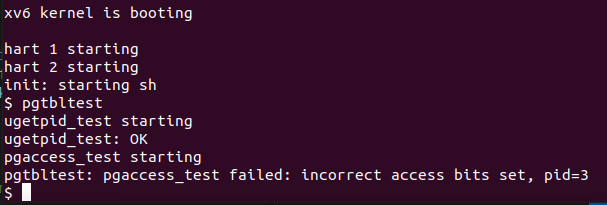

9. 在终端里运行 `./grade-lab-pgtbl ugetpid` 可进行评分：

   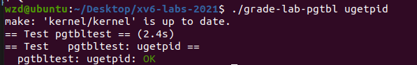

## 1.3 实验中遇到的问题和解决办法

  1. 问题：未正确在用户页表中添加共享页的映射。

- 解决办法：在 `proc_pagetable()` 函数中使用 `mappages()` 函数添加共享页的映射，并设置相应的标记位。

2. 问题：如果权限设置不正确，可能导致用户空间尝试写入只读页，导致错误或崩溃。如`proc_pagetable(struct proc *p)` 中映射 PTE 时的权限应该为 `PTE_R | PTE_U` 而不是 `PTE_R | PTE_U | PTE_W`。

- 解决办法：用户程序不应该直接写入代码或数据段，这是由操作系统负责的。因此，在将这些代码和数据映射到用户页表时，不应该使用可写权限。

## 1.4 实验心得

- 通过将系统调用的相关数据放在只读页中，以减少内核和用户空间之间的数据传输次数，从而加速系统调用的执行,体现了性能优化。

- 通过在每个进程的页表中插入只读页，掌握操作页表的方法，从而实现用户空间与内核空间之间的数据共享。
- 通过这次实验，了解了如何在页表中插入 `PTE`，以加速特定系统调用。

# 2. Print a page table (easy)

## 2.1 实验目的 

打印页表：深入理解 RISC-V 页表的结构和内容，并提供一个接受`pagetable_t` 参数，打印页表的函数 `vmprint()` 。通过这个实验，实现可视化页表的布局，了解页表的层次结构以及如何将虚拟地址映射到物理地址。

## 2.2 实验步骤

1. 在 `kernel/exec.c` 的 `exec()` 函数中找到 `return argc;` 之前的位置，插入条件语句 `if(p->pid==1) vmprint(p->pagetable);`，以在执行 `init` 进程时打印第一个进程的页表。

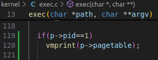

2. 在 `kernel/defs.h` 中定义 `vmprint` 的原型，以便在 `exec.c` 中调用：

   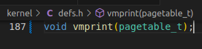

3. 仿照`kernel/vm.c`的`freewalk()`函数的写法，写`vmprintwalk()`函数，main函数调用exit()以退出程序：

   通过递归的方式逐层释放页表。

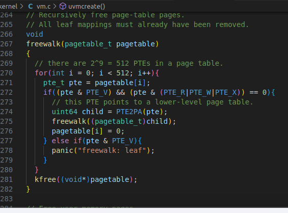

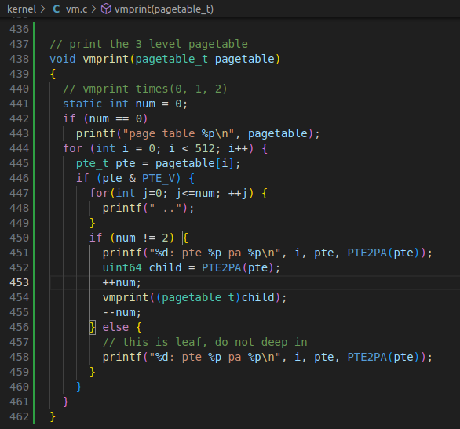

4. 保存后在终端里执行make qemu编译运行xv6（按照一定的格式打印出每个 `PTE` 的索引、`PTE` 的 16 进制表示和从 `PTE` 中提取的物理地址）：


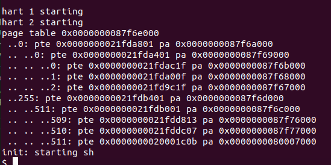

## 2.3 实验中遇到的问题和解决办法
 1. 问题：格式化输出问题。

- 解决办法：结合控制台调试，使用 `%p` 格式化符正确地打印了 64 位的十六进制 PTE 和物理地址。

## 2.4 实验心得

- 通过本次实验，我深入了解了操作系统内核的页表结构，并学会了遍历页表并打印出其中的信息。
- `vmprint` 的输出：第一行为输入的参数，接着输出 valid 的 PTE 以及指向的 pa（物理地址）。第 0 页包含指向其他页表页的指针，以构建页表的层次结构；第 2 页实际上是指向第 1 页的 PTE（位于第 1 页的索引 2 处）。第 1 页是第一个第 1 级页表页，它包含指向第 2 级页表页的 PTE。所以第 2 页中的 PTE 包含指向下一级页表页（第 2 级页表页）的物理地址。倒数第三页是指向用户栈的 PTE，它的权限通常是可读、可写和用户权限。用户栈用于存储进程在用户模式下调用函数时的局部变量和临时数据。

# 3 Detecting which pages have been accessed (hard)

## 3.1 实验目的

追踪被访问的页：一些垃圾回收器（一种自动内存管理形式）可以从哪些页面已被访问（读取或写入）的信息中获益。在实验中，添加一项`pgaccess()`系统调用检测哪些页面已被访问，通过检查 RISC-V 页表中的访问位来检测并向用户空间报告这些信息。每当 RISC-V 硬件走页器解决 TLB 未命中问题时，都会在 PTE 中标记这些位。

`pgaccess()`用于报告哪些页面已被访问。系统调用需要三个参数。首先，它需要第一个要检查的用户页面的起始虚拟地址。其次，它接受要检查的页面数。最后，它需要一个缓冲区的用户地址，以便将结果存储到位掩码（一种数据结构，每页使用一位，其中第一页对应的是最小有效位）中。

## 3.2 实验步骤

1. 在 `kernel/riscv.h` 中定义一个 `PTE_A`，其为 `Risc V` 定义的 access bit，设定访问位;

   `#define PTE_A (1L << 6)`

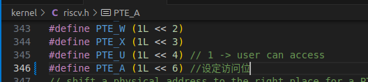

2. 在defs.h中声明walk；

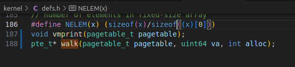

3. 在 `kernel/sysproc.c` 中实现 `sys_pgaccess()`， 获取系统调用参数

   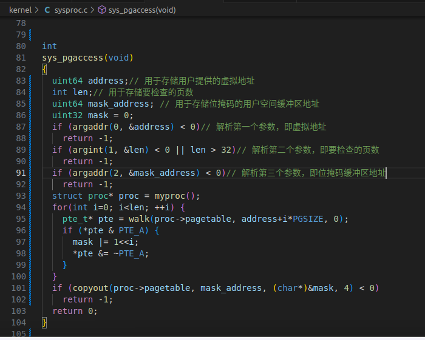

   使用  walk(pagetable_t, uint64, int) 来获取其页表项，重置该页表的 PTE_A 访问位，并使用位运算将其访问状态置入临时位向量中；最后将临时位向量拷贝至用户内存空间指定的地址中。

4. 保存后在终端里执行make qemu编译运行xv6；

5. 在命令行中输入`pgtbltest`，出现 :

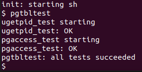

## 3.3 实验中遇到的问题和解决办法

  1. 问题：在实现 `pgaccess()` 系统调用功能时，未正确遍历用户页并检查 `PTE_A` 位。

- 解决办法：可以通过公式公式：

  ```
  `x = ((x&(1 << n)) ^ x) ^ (a << n)`。 
  ```

  `x` 为原值，`n` 为第 `n` 个值，`a` 为想要设置的值（0或1）。
  
  首先 `(x&(1 << n))` 的值为：保留第 `n` 位原来的值，其他位置零。再将此值与原值 `x` 异或，得到一个值：除了第 `n` 个值为零，其他位置为原值。（这是因为，与 `0` 异或的那一位为原值，与相同值异或的那一位为 `0`）。然后此时，再与 `(a << n)` 异或，将第 `n` 位设置为 `a` （这是因为与 `0` 异或为其本身）。


## 3.4 实验心得

- 通过本次实验，我学会了如何使用用户空间缓冲区和内核空间缓冲区之间的数据传输。

- 实现 pgaccess() 系统调用的过程中，我深入了解了 RISC-V 页表中的访问位 PTE_A，并学会了如何在内核中清除位。

- 通过实验初步了解了 RISC-V 中最常用的 Sv-39 （Page-Based 39-bit Virtual-Memory System ）分页机制

  |      |                      |
  | ---- | -------------------- |
  |      | 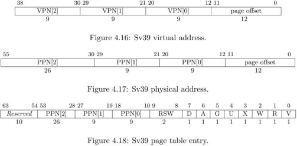 |

  上图即RISC-V 手册中关于Sv-39 的总结。参考对应上图中的 Figure 4.16 ，顾名思义，Sv- 39 的支持 39 位的虚拟地址，即 64 位的低 39 位是有效的，高位均为第 38 位的值；其一个页面大小为 4KB（必须边界对齐，即页面起始地址的低 12 位必须均为 0 ），故整个 39 位的地址的 0 到 11 位是页内偏移，在地址变换时不发生变化。

  除去页内偏移外，剩余高的 27 位被等分为了 3 段，每段各 9 位；每一段对应各级页表， 故 Sv-39 是一个三级页表的系统（比 x86 架构的 32 位二级页表要多一级），而每段的 9 位的 VPN （虚存页面编号）对应该级页表中的项，即每一个页表中有 29 = 512 项，这与页面大小是匹配的，因为每个页表项为 64 位（见上图中的 Figure 4.18 ），即 8 Byte ，故整个页表的大小恰好为 4KB ，即一页的大小。

  在 Sv-39 中，物理地址的格式对应上图中的 Figure 4.17 ，与虚拟地址类似，页面大小为4KB 且边界对齐；除了低位的 12 位页内偏移外，高位为物理的页号（共 44 位物理页号）。对于页表项，高位的未使用的 54 到 63 位始终置 0 ，而后是 44 位物理页号，而后的第 9 位和第8 位是供操作系统自定义使用的，而后的第 0 到第 7 位是该页面的状态位、权限设置和属性等。具体的 0 到 7 位的含义如下：

  第 7 位，Dirty bit ，对应的页面被写入后会被硬件置为 1 ，可被操作系统置为 0

  第 6 位，Access bit ，对应的页面被访问后会被硬件置为 1 ，可被操作系统置为 0

  第 5 位，Global bit ，其为 1 表示该页表项的映射对所有的内存空间均有效

  第 4 位到第 1 位，User/Read/Write/eXecute bit，用于控制页面的权限，由操作系统设置第 0 位，Valid bit，页表项的有效位

  在使用Sv-39 分页机制进行内存地址转换时，根页表的物理页面号 PPN 会被存储在SATP 寄存器的PPN 号的区间内，且 SATP 寄存器的MODE 段（分页模式）和 ASID 段（地址空间） 都被设为进程对应的值。某个指令访问某个虚拟地址时，处理器会：

  1. 读取 SATP 寄存器的 PPN 对应的页表根页面，

  2. 然后依次沿着各级 VPN  （虚存页面编号）找到虚拟地址对应的页表项，

  3. 检查权限无误后，根据指令的操作设置该页表项的Dirty/Access  位，

  4. 并且用该页表项的 PPN 与指令的页内偏移拼接，得到物理地址，

  5.	然后执行指令的操作。

# 4 实验检验得分

1. 在实验目录下创建创建`answers-pgtbl.txt`，填入1,2的测试结果

2. 在实验目录下创建`time.txt`, 填写完成实验时间数

3. 在终端中执行`make grade`

   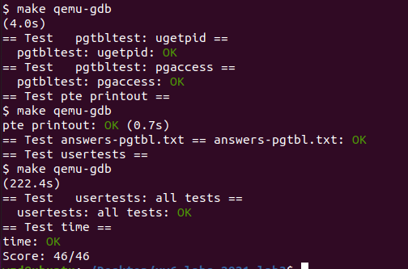

