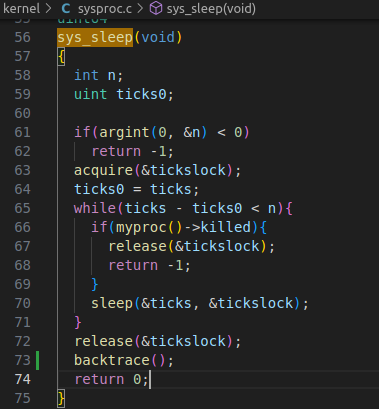

# 同济大学操作系统课程设计——Lab4: Traps

 ###### 2151422武芷朵  Tongji University, 2024 Summer

[TOC]

Lab4: Traps：中断实验

项目地址：[wzd232604/TJOS-xv6-2024-labs: 同济大学操作系统课程设计-xv6实验 (github.com)](https://github.com/wzd232604/TJOS-xv6-2024-labs)

# 综述

- `kernel/trampoline.S` ：从用户空间到内核空间并返回的汇编代码。
- `kernel/trap.c`：处理所有中断的代码。

切换到 `traps` 分支：

`git fetch`
`git checkout traps`
`make clean`


# 1. RISC-V assembly (easy)

##　1.1 实验目的

理解 RISC-V 汇编语言。

在 xv6 repo 中有一个文件 `user/call.c`。`make fs.img` 会对其进行编译，并生成 `user/call.asm` 中程序的可读汇编版本。

## 1.2 实验步骤

1. 执行`make fs.img`编译`user/call.c`

   

2. 在`user/call.asm`中生成可读的汇编版本,阅读函数g、f和main的代码:

   

   

3. 对于以下问题：

### Q. 01

> Which registers contain arguments to functions? For example, which register holds 13 in main's call to `printf`?

寄存器 a0 到 a7 （即寄存器 x10 到 x17 ）用于存放函数调用的参数。


main函数可知，在调用 printf 时，由寄存器 `a2` 保存 13。

### Q. 02

> Where is the call to function `f` in the assembly code for main? Where is the call to `g`? (Hint: the compiler may inline functions.)

函数 `f` 调用函数 `g` ；函数 `g` 使传入的参数加 3 后返回。

编译器会进行内联优化，`f` 被`printf("%d %d\n", f(8)+1, 13)` 调用，但是对应的会汇编代码却是直接将 `f(8)+1` 替换为 `12` 。


这就说明编译器对这个函数调用进行了优化，所以对于 `main` 函数的汇编代码来说，其并没有调用函数 `f` 和 `g` ，而是在运行之前由编译器对其进行了计算。

### Q. 03

> At what address is the function `printf` located?

查阅得到其地址在 `0x630`。


### Q. 04

> What value is in the register `ra` just after the `jalr` to `printf` in `main`?


30：使用 `auipc ra,0x0` 将当前程序计数器 `pc` 的值存入 `ra` 中。

34：`jalr 1536(ra)` 跳转到偏移地址 `printf` 处，也就是 `0x630` 的位置。

根据 [reference1](https://xiayingp.gitbook.io/build_a_os/hardware-device-assembly/risc-v-assembly) 中的信息，在执行完这句命令之后， 寄存器 `ra` 的值设置为 `pc + 4` ，也就是 `return address` 返回地址 `0x38`。即`jalr` 指令执行完毕之后，`ra` 的值为 `0x38`.

### Q. 05

> Run the following code.
>
> ```
> 	unsigned int i = 0x00646c72;
> 	printf("H%x Wo%s", 57616, &i);
> ```
>
> What is the output? [Here's an ASCII table]([ASCII Table - ASCII Character Codes, HTML, Octal, Hex, Decimal](https://www.asciitable.com/)) that maps bytes to characters.
>
> The output depends on that fact that the RISC-V is little-endian. If the RISC-V were instead big-endian what would you set `i` to in order to yield the same output? Would you need to change `57616` to a different value?
>
> [Here's a description of little- and big-endian](http://www.webopedia.com/TERM/b/big_endian.html) and [a more whimsical description](http://www.networksorcery.com/enp/ien/ien137.txt).


运行结果：打印 `He110 World`。

首先，`57616` 转换为 16 进制为 `e110`，所以格式化描述符 `%x` 打印出了它的 16 进制值。

其次，如果在小端（little-endian）处理器中，数据`0x00646c72` 的**高字节存储在内存的高位**，那么从**内存低位**，也就是**低字节**开始读取，对应的 ASCII 字符为 `rld`。


如果在 大端（big-endian）处理器中，数据 `0x00646c72` 的**高字节存储在内存的低位**，那么从**内存低位**，也就是**高字节**开始读取其 ASCII 码为 `dlr`。

所以如果需要满足大端序和小端序输出相同的内容 `i` ，那么在其为大端序的时候，`i` 的值应该为 `0x726c64`，这样才能保证从内存低位读取时的输出为 `rld` 。

无论 `57616` 在大端序还是小端序，它的二进制值都为 `e110` 。大端序和小端序只是改变了多字节数据在内存中的存放方式，并不改变其真正的值的大小，所以 `57616` 始终打印为二进制 `e110` 。

因此，如果在大端序，`i` 的值应该为 `0x00726c64` 才能保证与小端序输出的内容相同。且不需要改变 `57616` 的值。

### Q. 06

> In the following code, what is going to be printed after `'y='`? (note: the answer is not a specific value.) Why does this happen?
>
> ```
> 	printf("x=%d y=%d", 3);
> ```


因为函数的参数是通过寄存器`a1`, `a2` 等来传递。根据函数的传参规则, `y=` 后跟的值应该为寄存器 a2 的值。如果 `prinf` 少传递一个参数，那么其仍会从一个确定的寄存器中读取其想要的参数值，但是我们没有给出并存储这个确定的参数，所以函数将从此寄存器中获取到一个随机的不确定的值作为其参数。故而此例中，`y=`后面的值我们不能够确定，它是一个垃圾值。

## 1.3 实验中遇到的问题和解决办法

  1. 问题：注意如何运行`user/call.c`

     解决办法：区分执行`make fs.img`和执行`make qemu`。


## 1.4 实验心得

本次实验我进一步了解系统调用所发挥的重要作用，更清楚的认识到了系统调用的作用。

# 2. Backtrace (moderate)

## 2.1 实验目的 

实现一个回溯（`backtrace`）功能，用于在操作系统内核发生错误时，输出调用堆栈上的函数调用列表。这有助于调试和定位错误发生的位置。

## 2.2 实验步骤

1. 在 `kernel/defs.h` 中添加 `backtrace` 函数的原型`void backtrace(void);`，以便在 `sys_sleep` 中调用该函数。

   

2. GCC 编译器将当前正在执行的函数的帧指针（frame pointer）存储到寄存器 `s0` 中。在 `kernel/riscv.h` 中添加以下内联汇编函数:

   

3. 在 `kernel/printf.c` 中实现一个名为 `backtrace` 的函数。这个函数的目标是通过遍历调用堆栈中的帧指针来输出保存在每个栈帧中的返回地址。

   循环终止条件中，栈由高地址向低地址增长，栈底是当前页最高地址。

   

4. 在 `sys_sleep` 函数中调用 `backtrace` 函数。

   

5. 在 `kernel/printf.c` 的 `panic()` 函数中添加对 `backtrace()` 的调用

   

6. 保存后在终端里执行make qemu编译运行xv6；

7. 在命令行中输入`bttest`:

   

8. 退出 xv6 后运行 `addr2line -e kernel/kernel` 将 `bttest` 的输出作为输入, 输出对应的调用栈函数

   

   根据输出的源码行号找对应的源码, 发现就是 `backtrace()` 函数的所有调用栈的返回地址(函数调用完后的下一代码)(`sysproc.c`, `syscall.c`,`trap.c`)

## 2.3 实验中遇到的问题和解决办法
 1. 问题：在实现 `backtrace()` 函数时，可能会由于指针操作不当或者栈帧结构的错误导致无法正确遍历函数调用栈。

- 解决办法：首先，可以通过仔细阅读操作系统的文档和代码来理解栈帧结构和寄存器保存情况。其次，可以在实现过程中使用调试输出语句（例如 `printf`）来观察各个寄存器和栈帧的值，以便更好地理解程序的执行过程和排查错误。

 2. 问题：在 `backtrace` 函数中如何判断循环终止条件

- 解决办法：使用 PGROUNDDOWN 和 PGROUNDUP 宏可以帮助计算栈页的顶部和底部地址，从而确定循环终止的条件。

 3. 问题：帧指针在调用堆栈中的作用，如何使用它来访问上一级函数的返回地址

- 解决办法：编译器会在每个堆栈帧中放置一个帧指针，用于保存调用者帧指针的地址。需要反向跟踪并使用这些帧指针在堆栈中向上走动，并在每个堆栈帧中打印保存的返回地址。

  此外，返回地址与堆栈帧的帧指针有固定偏移（-8），而保存的帧指针与帧指针有固定偏移（-16）。

## 2.4 实验心得

在完成这个实验过程中，了解了函数调用栈的结构，以及如何通过获取栈指针 `fp` 和栈帧指针来遍历当前函数调用栈。我们实现了一个简单的 `backtrace()` 函数，它可以打印当前函数调用栈的返回地址链表，从而帮助我们在调试过程中追踪函数的调用情况。

# 3. Alarm (hard)

## 3.1 实验目的 

实现定时器系统调用：向 xv6 内核添加周期性地为进程设置定时提醒的功能，类似于用户级的中断/异常处理程序，能够让进程在消耗一定的 CPU 时间后执行指定的函数，然后恢复执行。通过实现这个功能，我们可以为计算密集型进程限制 CPU 时间，或者为需要周期性执行某些操作的进程提供支持。                                                                                                             

## 3.2 实验步骤

1. 在 Makefile 中添加`$U/_alarmtest\`，以便将 `alarmtest.c` 作为 xv6 用户程序编译。

   

2. 在 `user/user.h` 中设置正确的声明，两个系统调用的入口，分别用于设置定时器和从定时器中断处理过程中返回：

   

3. 更新 `user/usys.pl`（用于生成 `user/usys.S`）：在 `usys.pl` 中添加相应的用户态库函数入口：

   

4. 在 `syscall.h` 中声明 `sigalarm` 和 `sigreturn` 的用户态库函数：

   

5. 在 `syscall.c` 中添加对应的系统调用处理函数：

   

   

6. `kernel/proc.h`在 `sys_sigalarm` 中，将警报间隔和处理函数的指针存储在 `proc` 结构体的新字段中；`sys_sigreturn` 只返回零：

   

   ```
   // lab4-3
   uint64 sys_sigreturn(void) {
       return 0;
   }
   ```

7. 为了追踪自上次调用警报处理函数以来经过了多少个时钟中断，可以在 `proc.c` 中的 `allocproc()` 函数中初始化 `proc` 的这些字段。

   

8. 在 `sysproc.c` 中实现 `sys_sigalarm` 和 `sys_sigreturn` 的内核处理逻辑。

   添加一个新的系统调用 `sigalarm(interval, handler)`。如果一个应用调用了 `sigalarm(n, fn)`那么这个进程每消耗 `n` 个 ticks，内核应该确保函数 `fn` 被调用。当 `fn` 返回的时候，内核应该恢复现场，确保该进程在它刚才离开的地方继续执行。一个 tick 在 xv6 中是一个相当随意的单位时间，它取决于硬件时钟产生中断的快慢。如果一个应用调用 `sigalarm(0, 0)` ，内核应该停止产生周期性的警报调用。

   在传入的fn执行完毕后，需要在内核态对应的 `sys_sigreturn()` 中将备份的上下文恢复，然后返回用户态。

   

9. 修改 `kernel/trap.c` 中的 `usertrap()` 函数，实现周期性执行函数，判断是否为定时器中断的 if 语句块修改定时器中断发生时的行为，为每个有sigalarm 的进程更新其已经消耗的 ticks 数；判断该进程已经使用的 ticks 数是否已经足以触发 alarm：

   

   

10. 在 `sysproc.c` 中增加`cpytrapframe`函数声明：

    

11. 保存后在终端里执行make qemu编译运行xv6；

12. 在命令行中输入`alarmtest`:

    

13. 在 Makefile 中添加`$U/_usertests\`，运行 `usertests`

    

    

## 3.3 实验中遇到的问题和解决办法

  1. 问题：在实现周期性执行函数时，可能会遇到函数重入的问题，即周期性执行函数自身被递归调用导致程序异常。

- 解决办法：为了避免函数重入，可以在执行周期性执行函数之前设置一个标志位，当函数正在执行时，禁止再次调用该函数。可以在进程结构中添加一个 `alarm_handling` 变量来标志当前是否正在执行周期性执行函数，并在调用函数之前检查该标志位。在执行函数结束时，需要及时将标志位还原。

  2. 问题：如何在调用处理函数后，确保能够正确地恢复进程的执行状态，包括保存和恢复寄存器状态等。

- 解决办法：中断的时候已经在 `p->saved_trapframe` 中保存了中断帧信息，其中包含了被中断的用户态代码执行时的寄存器状态，因此我们需要将它恢复回 `p->trapframe`。

## 3.4 实验心得

通过本次实验，我对于定时中断的处理有了更深的理解。如果需要实现定时中断处理函数，这可能涉及到操作硬件定时器和设置中断处理程序，从而也加深了对中断处理机制的了解。

这次实验也涉及到了对系统调用的设计和实现，以及如何在用户程序和内核之间进行数据传递和共享。我再次巩固了如何设置声明和入口使得二者连接。

# 4 实验检验得分

1. 在终端中执行`make grade`

   （电脑性能原因导致超时）
   
   
