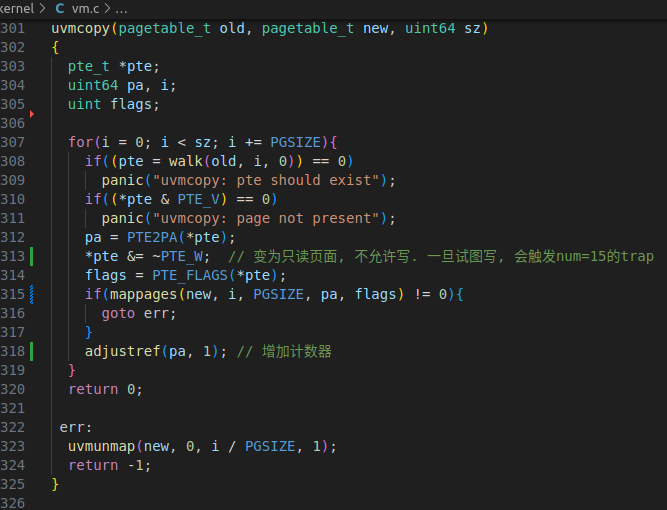

# 同济大学操作系统课程设计——Lab5: Copy-on-Write Fork for xv6

 ###### 2151422武芷朵  Tongji University, 2024 Summer

[TOC]

Lab5: Copy-on-write：写时复制实验

项目地址：[wzd232604/TJOS-xv6-2024-labs: 同济大学操作系统课程设计-xv6实验 (github.com)](https://github.com/wzd232604/TJOS-xv6-2024-labs)

# 综述

- 虚拟内存提供了一种间接性：内核可以将 PTE 标记为无效 (invalid) 或者只读 (read-only) 来阻止内存引用，并且导致页面故障 (page faults) 。在计算机系统中有一个说法，任何系统问题都能通过一定的间接性来解决。本次实验探索了一个例子：写时复制 copy-on-write fork.

- xv6 中的 fork() 系统调用会将父进程的所有用户空间内存复制到子进程中。如果父进程很大，拷贝可能需要很长时间。很多时候，子进程只会读取这些页面的内容，而不会写入这些页面。为了节约内存的实际用量，我们可以在子进程（或父进程）真正需要写入页面时才分配新的页面并进行数据的复制，这种机制被称为 COW （Copy On Write）fork 。

- 写入时拷贝（COW）fork() 的目的是推迟为子代分配和拷贝物理内存页，直到实际需要时才拷贝。

  COW fork() 只为子进程创建一个分页表，用户内存的 PTE 指向父进程的物理页面。COW fork() 会将父进程和子进程中的所有用户 PTE 标记为不可写。当任何一个进程试图写入这些 COW 页面时，CPU 都会强制产生一个页面故障。内核页面故障处理程序会检测到这种情况，为故障进程分配一个物理内存页面，将原始页面复制到新页面，并修改故障进程中的相关 PTE，使其指向新页面，这次的 PTE 标记为可写。当页面故障处理程序返回时，用户进程将能写入其页面副本。

  COW fork() 在释放实现用户内存的物理页时比较麻烦。一个给定的物理页可能被多个进程的页表引用，只有当最后一个引用消失时，才应释放该页。

切换到 `cow` 分支：

`git fetch`
`git checkout cow`
`make clean`

# 1.  Implement copy-on write(hard)

##　1.1 实验目的

实验的主要目的是在 xv6 操作系统中实现写时复制（Copy-on-Write，COW）的 fork 功能。传统的 `fork()` 系统调用会复制父进程的整个用户空间内存到子进程，而 COW fork() 则只复制父进程的页表，通过延迟分配和复制物理内存页面，只在需要时才进行复制，从而提高性能和节省资源。

## 1.2 实验步骤

1.在 kernel/riscv.h 中设置新的PTE标记位，标记是否为COW机制的页面：

`#define PTE_RSW (1L << 8) // RSW`

2. 在 `kernel/vm.c` 文件中，修改 `uvmcopy()` 函数，删除实际物理页面复制的语句，只复制父进程的页表，将父进程的物理页面映射到子进程，而不是分配新的页面。同时，清除父子进程的 PTE 中的 `PTE_W` 标志，使得页面标志 `PTE_COW`，用于标记写时复制页面。

   

   

   

3. 在 `kernel/trap.c` 文件中，修改 `usertrap()` 函数，添加对页面错误的处理。当页面错误是写错误时（`r_scause` 寄存器值为 `15`），调用 `cowfault()` 函数进行写时复制处理。

   

4. 在 `kernel/kalloc.c` 文件中，为每个页面维护一个引用计数。在页面分配时，将页面的引用计数初始化为 1;在freerange()中设所有物理页引用数=1；在kfree函数中对内存引用计数减1，如果引用计数为0ji当且仅当物理页没有被引用时才真正释放：

   

   

   

   

5. 在 `kernel/vm.c` 修改 `copyout()` 函数，使其在遇到 COW 页面时使用与页面故障相同的方式进行处理。

   

   定义 cow_alloc() 函数分配新的物理页：

   

   

6. 利用make qemu指令运行xv6：

7. 在命令行中输入`cowtest`:

   

8. 在命令行中输入`usertests`:

   

## 1.3 实验中遇到的问题和解决办法

1. 问题：在实现写时复制的过程中，页面引用计数的正确维护非常重要。如果引用计数没有被正确增加或减少，可能会导致页面在不应该释放的情况下被释放，从而引发系统崩溃或数据错误。

- 解决办法：为了确保页面引用计数的正确维护，在页面分配时将页面的引用计数初始化为 1。在复制页面或进行写时复制时，通过增加页面的引用计数来防止页面被意外释放。在页面不再被使用时，需要及时减少页面的引用计数，并在引用计数为 `0` 时释放页面。

2. 问题：在写时复制过程中，需要正确判断页面是否需要进行复制。如果没有正确判断，可能会导致页面被错误地共享，从而影响进程间的独立性和数据完整性。

- 解决办法：为了正确处理写时复制，在页面错误处理函数（cowfault()）中进行了如下判断：

  首先，判断触发页面错误的虚拟地址是否有效，并检查页面是否被标记为写时复制页面（使用 PTE_COW 标志）;如果页面不是写时复制页面，表示出现了异常情况，终止进程（通过设置 killed 标志并调用 exit() 函数）;如果页面是写时复制页面，并且引用计数大于等于 2，表示页面正在被多个进程共享，此时需要为新的进程分配一个新的物理页面，并将原页面的内容复制到新页面。 如果引用计数为 1，则表示当前进程是页面。

3. 问题：在处理页面错误时，需要确保进程的状态与页面错误的处理一致，否则可能导致进程出现错误状态或数据不一致。

- 解决办法：为了保持进程的状态一致性，处理页面错误时，会根据具体情况将进程标记为被杀死（`killed` 标志为 `1`）并调用 `exit()` 函数终止进程。这样可以确保页面错误处理与进程状态的一致性，并且避免了可能的错误状态和数据不一致。

## 1.4 实验心得

- 通过本次实验，我深入理解了写时复制技术在操作系统中的应用以及其带来的性能优化。在实现写时复制的过程中，我学会了如何处理页面引用计数、页面分配与释放，并且学会了在内核代码中增加新的系统调用。这些知识和经验对于我理解操作系统的内核原理以及进行系统级编程都非常有帮助。

# 2. 实验检验得分

1. 在实验目录下创建`time.txt`, 填写完成实验时间数

2. 在终端中执行`make grade`

   