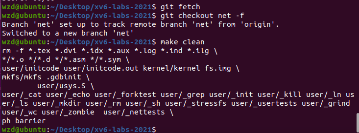
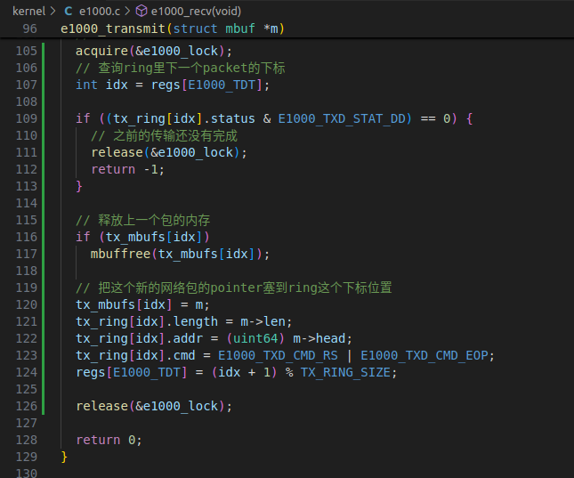
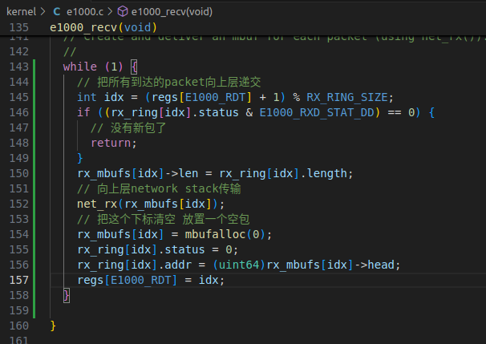
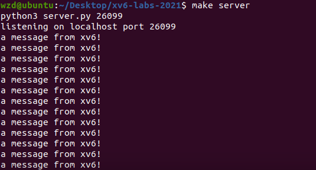
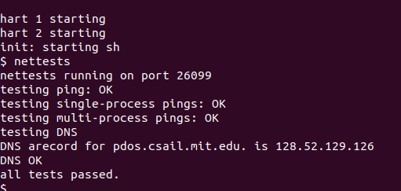
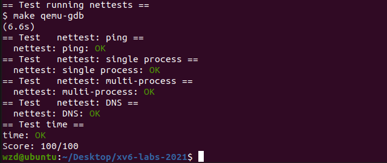

# 同济大学操作系统课程设计——Lab7: networking

 ###### 2151422武芷朵  Tongji University, 2024 Summer

[TOC]

Lab7: network driver：网卡驱动实验

项目地址：[wzd232604/TJOS-xv6-2024-labs: 同济大学操作系统课程设计-xv6实验 (github.com)](https://github.com/wzd232604/TJOS-xv6-2024-labs)

# 综述

切换到 `net` 分支：

`git fetch`
`git checkout net`
`make clean`

# 1.  Your Job (hard)

##　1.1 实验目的

编写一个在xv6操作系统中用于网络接口卡（network interface card, NIC）的设备驱动程序。通过这个实验学习如何初始化并操作一个虚拟的网络设备，以及如何处理网络通信，深入理解操作系统中设备驱动程序的工作原理。

我们将通过编写代码来初始化E1000网卡并实现`e1000_transmit`和`e1000_recv`函数，从而实现网络数据包的发送和接收。这些函数的具体实现将涉及`DMA`传输、数据包描述符等网络协议细节。

与NIC通信:

当操作系统与网络接口卡（NIC）进行通信时，会涉及到一些内存缓冲区和寄存器的管理，以便有效地接收和发送数据包。

1. **分配内存和设置环形缓冲区：** 在操作系统初始化时，它会为数据包的接收和发送分配一些内存空间，并创建两个环形缓冲区：`rx_ring`（接收环形缓冲区）和`tx_ring`（发送环形缓冲区）。这些环形缓冲区是一种循环数据结构，用于存储数据包以进行后续处理。
2. **以太网控制器初始化：** 操作系统会将关于`rx_ring`和`tx_ring`的详细信息写入NIC的寄存器中。这些信息包括每个缓冲区的起始地址、大小和其他描述符。这样，NIC就知道从哪里读取数据包，以及在接收数据包时将它们写入哪个内存区域。
3. **DMA数据传输：** 当NIC接收到一个数据包时，它使用DMA（直接内存访问）技术，无需CPU的干预，将数据包`Packet`的内容从硬件直接传输到操作系统为其分配的缓冲区中。这样可以提高数据传输的效率，避免了CPU的频繁介入。
4. **中断处理：** 在数据包`Packet`传输完成后，NIC会发出一个中断信号来通知操作系统有新的数据包到达。操作系统会响应这个中断，调用一个特定的异常处理函数来处理这个事件。在这个函数中，操作系统可以访问映射到寄存器的内存地址，以获取关于接收到的数据包的详细信息。
5. **描述符更新：** 异常处理函数会根据寄存器中的信息，找到对应的`rx_ring`描述符，该描述符包含了刚刚接收到的 `Packet` 的缓冲区地址。操作系统会将数据包从缓冲区读取出来，进行进一步的处理，例如将数据包传递给上层的网络协议栈进行解析和处理。

接收数据包:

当网络接口卡（NIC）接收到数据包时，并不是立刻通知操作系统，而是先将数据包存储在一个特殊的内存区域中，然后在适当的时候通知操作系统进行处理。这个处理过程采用了一种称为NAPI（New API）的机制，它的目的是减少中断的频率，从而提高系统的性能。

具体来说，NAPI的处理流程如下：

1. 驱动程序初始化时，会注册一个函数，这个函数用于从网络接口的缓冲区（Ring Buffer）中获取接收到的数据包。这个函数在之后的处理中被称为"poll函数"。
2. 驱动程序开启NAPI机制，这是一个可选的步骤，只有支持NAPI的驱动程序才会执行这个操作。
3. 当NIC接收到数据包并将其存储在内存中后，它会触发一个中断，并让CPU执行驱动程序注册的中断处理函数。
4. 驱动程序的中断处理函数使用`napi_schedule`函数唤醒一个叫做"softirq"的处理线程（NET_RX_SOFTIRQ），这个线程会在后台执行。在这个线程中，会调用之前注册的poll函数，从Ring Buffer中批量获取接收到的数据包。
5. 驱动程序会禁用当前NIC的中断，这样在处理数据包之前不会有新的中断干扰。
6. 在所有数据包处理完毕后，NAPI机制会被禁用，并重新启用NIC的中断。
7. 之后，整个过程从第3步开始重新执行。

这个过程的目标是优化数据包的处理，以减少中断的频率和系统资源的浪费。

在本次实验中，使用的是qemu模拟的e1000网卡，也同样采用了NAPI机制来处理接收到的数据包。

## 1.2 实验步骤

1. 实现`kernel/e1000.c` 中`e1000_transmit`函数，该函数负责将数据包发送到网络：

   

2. 实现`e1000_recv`函数，该函数负责接收并处理接收到的网络数据包：

   

   当网卡硬件产生一次中断后，中断处理过程 e1000_intr 会执行`regs[E1000_ICR] = 0xffffffff` 从而告知网卡已经完成了这次中断中所有数据包的处理，故而 e1000_recv() 需要将 rx_ring 中的所有内容都拷贝出去。

5. 打开一个终端窗口执行`make server`

   

6. 打开另一个窗口利用make qemu指令运行xv6，运行`nettests`以测试数据包的发送和接收功能：

   

## 1.3 实验中遇到的问题和解决办法

  1. 问题：在实现`e1000_transmit`函数时，数据包可能会丢失或者发送错误，导致网络通信不稳定。

- 解决办法：检查发送描述符设置： 确保在设置发送描述符时，正确地指定数据包的地址、长度和命令等参数。 保证互斥访问： 确保在修改发送缓冲区时使用互斥锁，以防止多个线程同时访问发送缓冲区而导致混乱。 调试和日志记录： 在代码中加入调试打印语句或者日志记录，可以帮助你追踪问题发生的位置和原因。

2. 问题： 在实现`e1000_recv`函数时，接收到的数据包可能没有被正确处理，导致网络数据无法正常传递给操作系统的协议栈。

- 解决办法：检查接收描述符设置： 确保在设置接收描述符时，地址和状态等参数被正确设置，以便正确接收数据包。验证网络协议栈调用： 确保在接收到数据包后，正确调用了网络协议栈的处理函数，以便处理接收到的数据。排查数据传递问题： 如果数据包在接收后没有正确传递给协议栈，可以检查数据包的处理流程，确保数据被正确传递和处理。

## 1.4 实验心得

- 通过这次实验，我深入了解了设备驱动程序的编写和调试过程，特别是在网络设备上的应用。我学会了如何初始化和操作虚拟网络设备，以及如何处理数据包的发送和接收。
- 我还学会了如何使用互斥锁和同步机制来保证多个进程或线程对设备的正确访问。

# 2 实验检验得分

1. 在实验目录下创建`time.txt`, 填写完成实验时间数

3. 在终端中执行`make grade`

