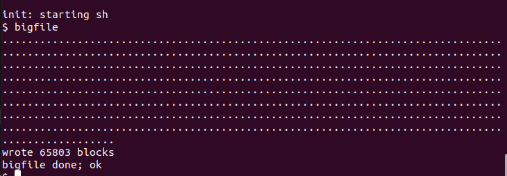
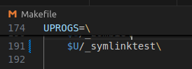

# 同济大学操作系统课程设计——Lab9: File system

 ###### 2151422武芷朵  Tongji University, 2024 Summer

[TOC]

Lab9: File system：文件系统实验

项目地址：[wzd232604/TJOS-xv6-2024-labs: 同济大学操作系统课程设计-xv6实验 (github.com)](https://github.com/wzd232604/TJOS-xv6-2024-labs)

# 综述

- 为 xv6 文件系统添加大文件和符号链接。

切换到 `fs` 分支：

`git fetch`
`git checkout fs`
`make clean`

# 1. Large files (moderate)

##　1.1 实验目的

本次实验的目的是扩展 xv6 文件系统，实现双层映射的机制，使其支持更大的文件大小。

原始的xv6 的实现中，其文件系统使用基于inode 和目录的文件管理方式，但其 inode 仅为两级索引，共有 12 个直接索引块和 1 个间接索引块，间接索引块可以指向 256 个数据块，故而一个文件最多拥有 268 个数据块，或 268 * BSIZE 字节（在 xv6 中，BSIZE 为 1024）。

可以改经为使用三级索引，共有 11 个直接索引，1 个间接索引块和 1 个二级间接索引块，故总共支持文件大小为 11 + 256 + 256 × 256 = 65803 块。

## 1.2 实验步骤

1. 打开 `kernel/fs.h` 中，查找 `NDIRECT` 和 `NINDIRECT` 的定义。这些常量表示直接块和单间接块的数量：

   

   原先 xv6 的 inode 包含 12 个直接数据块号`NDIRECT`和 1 个间接数据块号`NINDIRECT`，其中间接数据块包含 256 个块号（`BSIZE / sizeof(uint)`），因此一个 xv6 的文件最多只能含有 268 个数据块的数据。

   修改宏定义，将单层映射改为双层映射，以支持更大的文件大小：

   将一个直接数据块号替换成一个两层间接数据块号，即指向一个包含间接数据块号的数据块，这样使每个 inode 都支持一个 "双向 "块，其中包含 256 个单向块地址，每个单向块最多可包含 256 个数据块地址。这样，一个文件最多可以包含 65803 个数据块，即 256*256+256+11 个数据块（11 个而不是 12 个，因为还需要牺牲一个直接数据块的编号来使用双向数据块）

   

   `NDBL_INDIRECT` 宏，表示双间接块能够存储的块号数量，即单间接块的数量的平方（256 * 256）

2. 在 `kernel/file.h` 中更新文件的 `struct inode` 数据结构，在 `kernel/fs.h` 中更新文件的 `struct dinode` 数据结构，修改 `addrs[]` 数组的大小以支持双间接块。

   

   

   在 `struct inode` 中，`addrs` 数组用于存储直接块、单间接块和现在新增的双间接块的块号。

3. 在 `kernel/fs.c` 的 `bmap` 函数(负责将文件的逻辑块号映射到磁盘块号)中，添加双层间接映射的逻辑。

   

   当文件系统需要访问一个块号 `bn` 对应的数据块时，`bmap()` 函数被用来将逻辑块号映射到实际的磁盘块号。这段新增的代码处理了对于超过单间接块限制的块号，即 `bn` 大于等于 `NINDIRECT` 时。

4. 在 `kernel/fs.c` 的 `itrunc` 函数中，添加对双层间接映射的清除逻辑，确保释放双层映射的数据块。

   

5. 利用make qemu指令运行xv6：

6. 在命令行中输入`bigfile`:

   

## 1.3 实验中遇到的问题和解决办法

  1. 问题：如何实现双层映射的逻辑以支持更大的文件大小

- 解决办法：通过修改文件的宏定义、映射函数以及清除函数，增加双层间接映射的支持，确保正确的数据块映射和释放。

2. 问题： 如何理清楚各种数据块号之间的关系。

- 解决办法：xv6文件系统使用inode来管理文件。修改`bmap`函数，还需要同步修改`itrunc()` ，使得其在丢弃 `inode` 的时候回收所有的数据块。由于添加了二级间接块的结构，因此也需要添加对该部分的块的释放的代码。释放的方式同一级间接块号的结构，只需要两重循环去分别遍历二级间接块以及其中的一级间接块。

## 1.4 实验心得

- 在本次实验中，我成功地修改了 `xv6` 操作系统的文件系统，实现了双层映射的机制，从而使文件可以占据更大的大小。这个实验让我更深入地理解了文件系统底层的数据管理和映射逻辑。
- 通过修改宏定义、更新数据结构以及添加映射和清除逻辑，我学会了如何对操作系统的核心部分进行扩展和改进。

# 2. Symbolic links (moderate)

## 2.1 实验目的 

本次实验的主要目的是在 xv6 操作系统中实现符号链接（软链接）的功能。符号链接是一种通过路径名来引用另一个文件的方式，与硬链接不同，符号链接可以跨越不同的磁盘设备。通过实现这个系统调用，深入理解路径名查找的工作原理。

## 2.2 实验步骤

符号链接就是在文件中保存指向文件的路径名，在打开文件的时候根据保存的路径名再去查找实际文件。symlink的系统调用就是创建一个inode，设置类型为T_SYMLINK，然后向这个inode中写入目标文件的路径。

1. 创建系统调用：添加有关 `symlink` 系统调用的定义声明

   `kernel/syscall.h`：

    

   

   

   `kernel/syscall.c`：

   

   `user/usys.pl` ：

   

   `user/user.h`：

   

2. 在 `kernel/stat.h` 中添加一个新的文件类型 `T_SYMLINK`，用于表示符号链接。这将帮助区分普通文件和符号链接。

   

3. 在 `kernel/fcntl.h` 中添加一个新的打开标志 `O_NOFOLLOW`，该标志可以与 `open` 系统调用一起使用。

   

4. 在 `kernel/sysfile.c` 中实现 `sys_symlink` 系统调用，将目标路径写入新创建的符号链接文件的数据块中。

   函数先通过 `create()` 创建符号链接路径对应的 `inode` 结构（同时使用 `T_SYMLINK` 与普通的文件进行区分）。然后通过 `writei()` 将链接的目标文件的路径写入 `inode` 的 `block`中即可。在这个过程中，无需判断连接的目标路径是否有效。

   

   函数 `create()` 会返回创建的 `inode`，此时也会持有其 `inode` 的锁。而后续 `writei()` 是需要在持锁的情况下才能写入。在结束操作后（不论成功与否），都需要调用 `iunlockput()` 来释放 `inode` 的锁和其本身，该函数是 `iunlock()` 和 `iput()` 的组合，前者即释放 `inode` 的锁，而后者是减少一个 `inode` 的引用（对应字段 `ref`, 记录内存中指向该 `inode` 的指针数，这里的 `inode` 实际上是内存中的 `inode`, 是从内存的 `inode` 缓存 `icache` 分配出来的, 当 `ref` 为 0 时就会回收到 `icache` 中），表示当前已经不需要持有该 `inode` 的指针对其继续操作了。

5. 修改 `open` 系统调用，以处理路径引用到符号链接的情况。如果文件不存在，`open` 应该失败。当进程在 `flags` 中指定了 `O_NOFOLLOW` 时，`open` 应该打开符号链接而不是跟随链接。

   

   如果指定的文件是符号链接且没有设置 O_NOFOLLOW，读取符号链接的目标路径，递归解析目标路径，打开文件并返回文件描述符。

6. 在 `Makefile` 中添加对测试文件 `symlinktest.c` 的编译

   

7. 保存后在终端里执行`make qemu`，运行`symlinktest` 

   

## 2.3 实验中遇到的问题和解决办法
 1. 问题：如何正确处理软链接的创建和打开逻辑？

- 解决办法：在 `sys_symlink` 中，将目标路径写入符号链接的数据块。在 `sys_open` 中，对打开的文件进行判断，如果是符号链接则递归解析，直至找到实际文件或检测到循环。

## 2.4 实验心得

- 在本次实验中，我成功地向 xv6 操作系统添加了符号链接（软链接）的支持。符号链接是一种特殊类型的文件，可以跨越磁盘设备引用其他文件。实现了 `symlink(char *target, char *path)` 系统调用，该调用可以创建一个新的符号链接文件，将其指向目标文件。

# 3 实验检验得分

1. 在实验目录下创建`time.txt`, 填写完成实验时间数

3. 在终端中执行`make grade`

   
